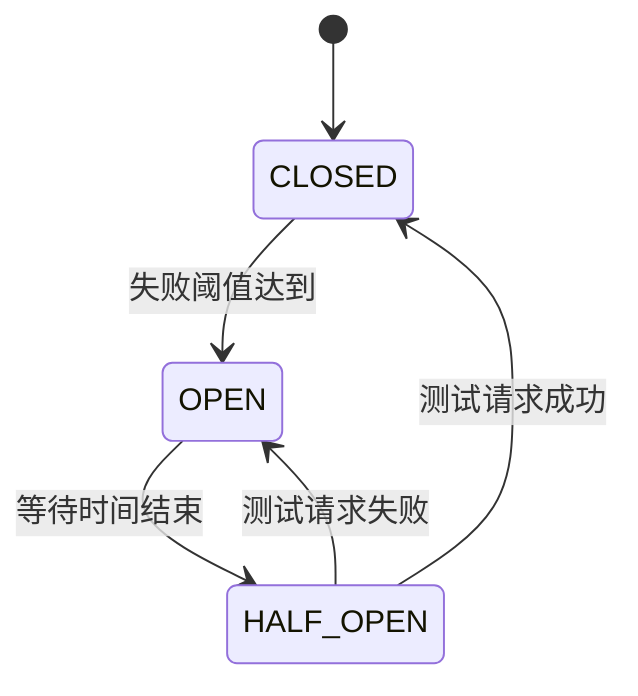

> Spring Cloud 熔断限流深度解析  
  
## 1. 核心原理与架构  
  
### 1.1 熔断器状态机  
  

  
### 1.2 限流算法对比  
  
| 算法         | 原理                   | 优点               | 缺点               |  
|--------------|------------------------|--------------------|--------------------|  
| 计数器       | 固定窗口计数           | 实现简单           | 临界问题           |  
| 滑动窗口     | 时间片细分统计         | 精度较高           | 内存消耗较大       |  
| 漏桶         | 恒定速率处理           | 平滑流量           | 无法应对突发流量   |  
| 令牌桶       | 定期放入令牌           | 允许突发流量       | 实现较复杂         |  
  
## 2. 组件选型指南  
  
### 2.1 功能矩阵  
  
| 特性          | Hystrix       | Resilience4j  | Sentinel      |  
|---------------|---------------|---------------|---------------|  
| 熔断降级      | ✅            | ✅            | ✅            |  
| 流量控制      | ❌            | ✅            | ✅            |  
| 系统保护      | ❌            | ❌            | ✅            |  
| 监控仪表盘     | ✅            | ✅            | ✅            |  
| 规则持久化    | ❌            | ❌            | ✅            |  
| 响应式支持    | ❌            | ✅            | ✅            |  
  
### 2.2 选型建议  
  
**Hystrix**：  
- 已有系统维护  
- 简单熔断需求  
- 兼容老版本Spring Cloud  
  
**Resilience4j**：  
- 新项目开发  
- 需要轻量级解决方案  
- 函数式编程偏好  
  
**Sentinel**：  
- 复杂流量控制需求  
- 系统级保护需求  
- 生产级监控需求  
  
## 3. Resilience4j 实现  
  
### 3.1 基础配置  
  
**Maven依赖**：  
```xml  
<dependency>  
    <groupId>org.springframework.cloud</groupId>    <artifactId>spring-cloud-starter-circuitbreaker-resilience4j</artifactId></dependency>  
```  
  
**熔断器配置**：  
```yaml  
resilience4j:  
  circuitbreaker:    instances:      backendA:        failureRateThreshold: 50        minimumNumberOfCalls: 10        slidingWindowSize: 10        slidingWindowType: TIME_BASED        waitDurationInOpenState: 5s  
```  
  
### 3.2 组合使用  
  
**Bulkhead + Retry**：  
```java  
CircuitBreaker circuitBreaker = CircuitBreaker.ofDefaults("backendA");  
Bulkhead bulkhead = Bulkhead.ofDefaults("backendA");  
Supplier<String> decoratedSupplier = Decorators.ofSupplier(() -> backendService.doSomething())  
    .withBulkhead(bulkhead)    .withCircuitBreaker(circuitBreaker)    .withRetry(Retry.ofDefaults("backendA"))    .decorate();  
```  
  
## 4. Sentinel 实现  
  
### 4.1 控制台部署  
  
**Docker启动**：  
```bash  
docker run --name sentinel-dashboard -p 8080:8080 -d bladex/sentinel-dashboard```  
  
**客户端配置**：  
```yaml  
spring:  
  cloud:    sentinel:      transport:        dashboard: localhost:8080      eager: true  
```  
  
### 4.2 规则定义  
  
**流量控制规则**：  
```java  
private void initFlowRules() {  
    List<FlowRule> rules = new ArrayList<>();    FlowRule rule = new FlowRule();    rule.setResource("doSomething");    rule.setGrade(RuleConstant.FLOW_GRADE_QPS);    rule.setCount(20);    rules.add(rule);    FlowRuleManager.loadRules(rules);}  
```  
  
## 5. 生产实践  
  
### 5.1 监控集成  
  
**Prometheus配置**：  
```yaml  
management:  
  endpoints:    web:      exposure:        include: health,prometheus  metrics:    tags:      application: ${spring.application.name}  
```  
  
**Grafana看板**：  
- 请求QPS  
- 异常比例  
- 响应时间百分位  
- 熔断器状态  
  
### 5.2 故障演练  
  
**ChaosBlade实验**：  
```bash  
blade create k8s pod-network loss --percent 80 --namespace spring-cloud --timeout 300```  
  
## 6. 高级特性  
  
### 6.1 自适应保护  
  
**Sentinel系统规则**：  
```java  
List<SystemRule> rules = new ArrayList<>();  
SystemRule rule = new SystemRule();  
rule.setHighestSystemLoad(4.0);  
rule.setAvgRt(200);  
rule.setQps(500);  
rules.add(rule);  
SystemRuleManager.loadRules(rules);  
```  
  
### 6.2 热点参数限流  
  
```java  
@SentinelResource(value = "doSomething", blockHandler = "handleBlock")  
public String doSomething(String param1, int param2) {  
    // 业务逻辑  
}  
  
public String handleBlock(String param1, int param2, BlockException ex) {  
    return "限流处理";  
}  
```  
  
## 7. 最佳实践  
  
### 7.1 熔断配置  
  
**推荐参数**：  
```yaml  
failureRateThreshold: 60%  
minimumNumberOfCalls: 20  
waitDurationInOpenState: 10s  
```  
  
### 7.2 降级策略  
  
**多级降级方案**：  
1. 本地缓存  
2. 兜底数据  
3. 友好提示  
  
### 7.3 性能优化  
  
**线程池隔离**：  
```java  
BulkheadConfig config = BulkheadConfig.custom()  
    .maxConcurrentCalls(20)    .maxWaitDuration(Duration.ofMillis(500))    .build();  
```  
  
## 8. 迁移指南  
  
### 8.1 Hystrix迁移  
  
**兼容层配置**：  
```java  
@Bean  
public HystrixCircuitBreakerFactory resilience4jCircuitBreakerFactory() {  
    return new HystrixResilience4jCircuitBreakerFactory();}  
```  
  
### 8.2 渐进式迁移  
  
1. **并行运行**：  
   ```yaml  
   spring:  
     cloud:       circuitbreaker:         resilience4j:           enabled: true         hystrix:           enabled: true  
   ```  
2. **逐步替换**：  
   - 从边缘服务开始  
   - 监控对比效果  
  
3. **全面切换**：  
   ```yaml  
   spring:  
     cloud:       circuitbreaker:         hystrix:           enabled: false  
   ```