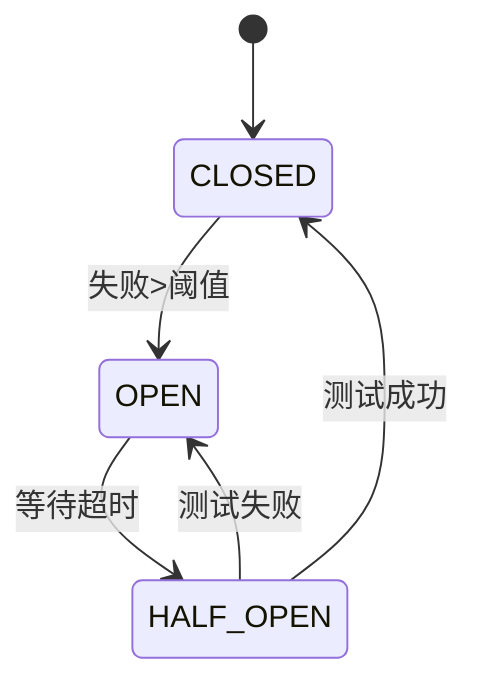
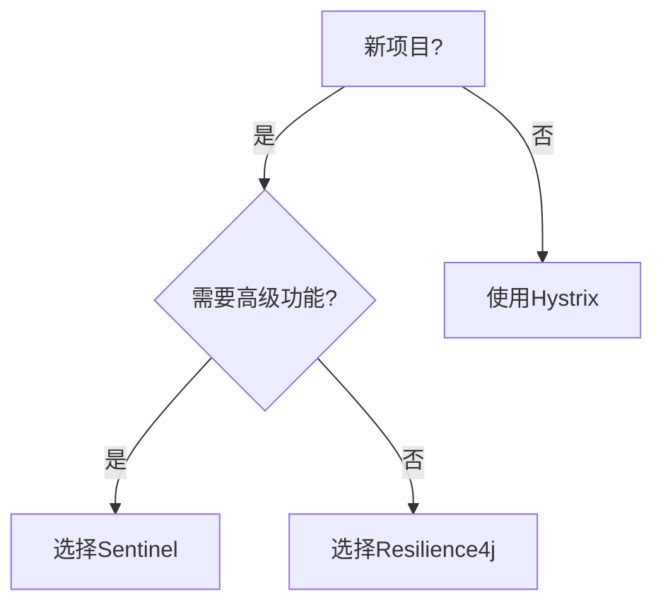

## 1. 核心机制 

### 1.1 熔断器工作流程



<div class="grid cards" markdown>

-   **限流算法**
    - 计数器：简单高效
    - 滑动窗口：精度更高  
    - 漏桶：平滑流量
    - 令牌桶：允许突发

-   **熔断状态**
    - Closed：正常请求
    - Open：快速失败
    - Half-Open：试探恢复

</div>

## 2. 组件选型 

### 2.1 功能对比

| 能力        | Resilience4j | Sentinel |
|------------|-------------|----------|
| 熔断降级      | ✅           | ✅        |
| 流量控制      | ✅           | ✅        |
| 系统保护      | ❌           | ✅        |
| 热点限流      | ❌           | ✅        |
| 响应式支持    | ✅           | ✅        |

### 2.2 选型决策树



## 3. Resilience4j实践 

### 3.1 熔断配置

<details>
<summary>点击查看完整配置</summary>

```yaml
resilience4j:
  circuitbreaker:
    instances:
      backendA:
        failureRateThreshold: 50
        minimumNumberOfCalls: 10
        slidingWindowSize: 10
        waitDurationInOpenState: 5s
  retry:
    instances:
      backendA:
        maxAttempts: 3
        waitDuration: 100ms
```
</details>

### 3.2 组合策略

```java
CircuitBreaker circuitBreaker = CircuitBreaker.ofDefaults("backendA");
Bulkhead bulkhead = Bulkhead.ofDefaults("backendA");

Supplier<String> decoratedSupplier = Decorators.ofSupplier(() -> service.call())
    .withCircuitBreaker(circuitBreaker)
    .withBulkhead(bulkhead)
    .withRetry(Retry.ofDefaults("backendA"))
    .decorate();
```

## 4. Sentinel实战 

### 4.1 控制台部署

```bash
docker run -d -p 8080:8080 --name sentinel bladex/sentinel-dashboard
```

### 4.2 热点规则

```java
ParamFlowRule rule = new ParamFlowRule("doSomething")
    .setParamIdx(0)
    .setCount(10);
ParamFlowRuleManager.loadRules(Collections.singletonList(rule));
```

## 5. 生产配置 

### 5.1 监控看板

**Grafana指标**：
- 请求QPS
- 异常比例
- 响应时间P99
- 线程池使用率

### 5.2 推荐参数

| 场景         | 熔断阈值 | 最小请求数 | 等待时间 |
|-------------|--------|--------|--------|
| 关键业务      | 40%    | 20     | 10s    |
| 普通业务      | 60%    | 10     | 5s     |
| 非核心业务    | 80%    | 5      | 3s     |

## 6. 迁移方案 

### 6.1 双模式运行

```yaml
spring:
  cloud:
    circuitbreaker:
      resilience4j:
        enabled: true
      hystrix:
        enabled: true
```

### 6.2 渐进式替换

1. **新增功能**：使用Resilience4j/Sentinel
2. **存量改造**：逐步替换Hystrix
3. **监控对比**：确保稳定性
4. **完全迁移**：停用Hystrix

## 7. 常见问题 {#faq}

### 7.1 熔断误判

**解决方案**：
```yaml
resilience4j:
  circuitbreaker:
    ignoreExceptions:
      - BusinessException
```

### 7.2 限流精度

**滑动窗口配置**：
```yaml
slidingWindowType: TIME_BASED
slidingWindowSize: 60s
minimumNumberOfCalls: 50
```
