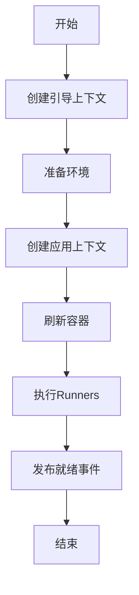
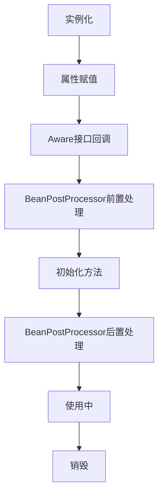

# Spring Boot 核心知识点


> Spring Boot 让创建独立的、生产级的基于Spring的应用变得容易，"约定优于配置"的思想贯穿始终。

---

## 1. 核心启动流程（源码级）

Spring Boot 应用启动过程是一个复杂而精密的过程，主要分为初始化和运行两个阶段。

### 1.1. 初始化 SpringApplication

当我们执行 `SpringApplication.run()` 方法时，首先会创建 `SpringApplication` 实例：

```java
public static ConfigurableApplicationContext run(Class<?> primarySource, String... args) {
   return run(new Class[]{primarySource}, args);
}

public static ConfigurableApplicationContext run(Class<?>[] primarySources, String[] args) {
   return (new SpringApplication(primarySources)).run(args);
}
```

在构造方法中，主要完成以下初始化工作：

- **配置基本的环境变量**
- **准备必要的资源**
- **初始化构造器**
- **注册监听器**

这个初始化阶段为后续运行 `SpringApplication` 实例做好了准备。

具体的初始化过程如下：

```java
public SpringApplication(Class<?>... primarySources) {
   this(null, primarySources);
}

@SuppressWarnings({ "unchecked", "rawtypes" })
public SpringApplication(ResourceLoader resourceLoader, Class<?>... primarySources) {
   this.resourceLoader = resourceLoader;
   Assert.notNull(primarySources, "PrimarySources must not be null");
   this.primarySources = new LinkedHashSet<>(Arrays.asList(primarySources));
   // 推断应用类型（SERVLET、REACTIVE 或 NONE）
   this.webApplicationType = WebApplicationType.deduceFromClasspath();
   this.bootstrapRegistryInitializers = new ArrayList<>(
           getSpringFactoriesInstances(BootstrapRegistryInitializer.class));
   /**
    * 加载初始化器
    * 从 spring.factories 文件中找出 Key 为 ApplicationContextInitiallizer 的类并实例化
    * 并设置到 SpringApplication的 initiallizer 属性中
    */
   setInitializers((Collection) getSpringFactoriesInstances(ApplicationContextInitializer.class));
   /**
    * 加载监听器
    * 从 spring.factories 文件中找出 Key 为 ApplicationListener 的类并实例化
    * 监听器设置到 SpringApplication的 listeners 属性中
    */
   setListeners((Collection) getSpringFactoriesInstances(ApplicationListener.class));
   // 获取启动类
   this.mainApplicationClass = deduceMainApplicationClass();
}
```

初始化过程中的关键步骤说明：

1. **推断应用类型**：根据类路径判断是Web应用还是普通应用
2. **加载初始化器**：用于在容器刷新前执行一些初始化工作
3. **加载监听器**：用于监听启动过程中的各种事件
4. **获取启动类**：确定主应用类，用于日志显示等

### 1.2. 执行 run 方法

`run` 方法是 Spring Boot 应用启动的核心，它完成了从初始化到最终运行的全过程：

```java
public ConfigurableApplicationContext run(String... args) {
   // 记录启动时间
   long startTime = System.nanoTime();
   // 创建引导上下文
   DefaultBootstrapContext bootstrapContext = this.createBootstrapContext();
   ConfigurableApplicationContext context = null;
   // 配置 Headless 属性（用于无显示器环境）
   this.configureHeadlessProperty();
   // 获取 SpringApplicationRunListeners
   SpringApplicationRunListeners listeners = this.getRunListeners(args);
   // 发布 ApplicationStartingEvent 事件
   listeners.starting(bootstrapContext, this.mainApplicationClass);

   try {
      // 封装命令行参数
      ApplicationArguments applicationArguments = new DefaultApplicationArguments(args);
      // 准备环境
      ConfigurableEnvironment environment = this.prepareEnvironment(listeners, bootstrapContext, applicationArguments);
      this.configureIgnoreBeanInfo(environment);
      // 打印 banner
      Banner printedBanner = this.printBanner(environment);
      // 创建应用上下文
      context = this.createApplicationContext();
      context.setApplicationStartup(this.applicationStartup);
      // 准备上下文
      this.prepareContext(bootstrapContext, context, environment, listeners, applicationArguments, printedBanner);
      // 核心：刷新容器，触发 bean 的加载、初始化
      this.refreshContext(context);
      // 刷新后的操作
      this.afterRefresh(context, applicationArguments);

      /**
       * afterRefresh方法源码:
       * protected void afterRefresh(ConfigurableApplicationContext context, ApplicationArguments args) {
       *     // 默认为空实现，留给子类扩展
       *     // 可以在此处添加容器刷新后的自定义逻辑
       * }
       */

      // 计算启动耗时
      Duration timeTakenToStartup = Duration.ofNanos(System.nanoTime() - startTime);
      if (this.logStartupInfo) {
         (new StartupInfoLogger(this.mainApplicationClass)).logStarted(this.getApplicationLog(), timeTakenToStartup);
      }

      // 发布 ApplicationStartedEvent 事件
      listeners.started(context, timeTakenToStartup);
      // 执行 ApplicationRunner、CommandLineRunner
      this.callRunners(context, applicationArguments);
   } catch (Throwable var12) {
      this.handleRunFailure(context, var12, listeners);
      throw new IllegalStateException(var12);
   }

   try {
      Duration timeTakenToReady = Duration.ofNanos(System.nanoTime() - startTime);
      // 发布 ApplicationReadyEvent 事件
      listeners.ready(context, timeTakenToReady);
      return context;
   } catch (Throwable var11) {
      this.handleRunFailure(context, var11, (SpringApplicationRunListeners)null);
      throw new IllegalStateException(var11);
   }
}
```

**run方法执行流程**：



详细执行步骤说明：

1. **创建引导上下文 createBootstrapContext()**

   ```java
   // SpringApplication.createBootstrapContext() 源码分析
   private DefaultBootstrapContext createBootstrapContext() {
       DefaultBootstrapContext bootstrapContext = new DefaultBootstrapContext();
       this.bootstrapRegistryInitializers.forEach((initializer) -> {
           initializer.initialize(bootstrapContext);
       });
       return bootstrapContext;
   }
   ```

   **源码执行流程详解**：

   1. 创建DefaultBootstrapContext实例：
      - 提供引导阶段的基础设施
      - 管理早期初始化的对象

   2. 执行所有BootstrapRegistryInitializer：
      - 初始化引导注册表
      - 配置早期的系统服务
      - 准备核心系统变量

2. **准备环境 prepareEnvironment()**

   ```java
   // SpringApplication.prepareEnvironment() 源码分析
   private ConfigurableEnvironment prepareEnvironment(SpringApplicationRunListeners listeners,
           DefaultBootstrapContext bootstrapContext, ApplicationArguments applicationArguments) {
       // 创建并配置环境
       ConfigurableEnvironment environment = getOrCreateEnvironment();
       configureEnvironment(environment, applicationArguments.getSourceArgs());
       ConfigurationPropertySources.attach(environment);
       
       // 发布环境准备事件
       listeners.environmentPrepared(bootstrapContext, environment);
       
       // 绑定环境到SpringApplication
       bindToSpringApplication(environment);
       
       // 如果不是自定义环境，则转换为标准环境类型
       if (!this.isCustomEnvironment) {
           environment = new EnvironmentConverter(getClassLoader()).convertEnvironmentIfNecessary(environment,
                   deduceEnvironmentClass());
       }
       
       // 附加配置属性源
       ConfigurationPropertySources.attach(environment);
       return environment;
   }
   ```

   **源码执行流程详解**：

   1. `getOrCreateEnvironment()`：
      - 根据应用类型创建对应的环境对象
      - Web应用创建StandardServletEnvironment
      - 非Web应用创建StandardEnvironment

   2. `configureEnvironment()`：
      - 配置PropertySources
      - 配置Profiles
      - 添加命令行参数

   3. `ConfigurationPropertySources.attach()`：
      - 将配置属性源附加到环境

   4. `listeners.environmentPrepared()`：
      - 发布ApplicationEnvironmentPreparedEvent事件
      - 允许监听器修改环境

   5. `bindToSpringApplication()`：
      - 将环境属性绑定到SpringApplication
      - 支持spring.main.*配置项

3. **创建应用上下文 createApplicationContext()**

   ```java
   // SpringApplication.createApplicationContext() 源码分析
   protected ConfigurableApplicationContext createApplicationContext() {
       Class<?> contextClass = this.applicationContextClass;
       if (contextClass == null) {
           try {
               switch (this.webApplicationType) {
               case SERVLET:
                   contextClass = Class.forName(DEFAULT_SERVLET_WEB_CONTEXT_CLASS);
                   break;
               case REACTIVE:
                   contextClass = Class.forName(DEFAULT_REACTIVE_WEB_CONTEXT_CLASS);
                   break;
               default:
                   contextClass = Class.forName(DEFAULT_CONTEXT_CLASS);
               }
           }
           catch (ClassNotFoundException ex) {
               throw new IllegalStateException(
                       "Unable create a default ApplicationContext, please specify an ApplicationContextClass", ex);
           }
       }
       return (ConfigurableApplicationContext) BeanUtils.instantiateClass(contextClass);
   }
   ```

   **源码执行流程详解**：

   1. 根据webApplicationType选择合适的ApplicationContext实现类：
      - SERVLET类型：`AnnotationConfigServletWebServerApplicationContext`
      - REACTIVE类型：`AnnotationConfigReactiveWebServerApplicationContext`
      - 默认类型：`AnnotationConfigApplicationContext`

   2. 使用反射实例化选定的ApplicationContext类

   3. 创建的上下文随后会在prepareContext方法中进行配置：

   ```java
   // SpringApplication.prepareContext() 源码分析
   private void prepareContext(DefaultBootstrapContext bootstrapContext, ConfigurableApplicationContext context,
           ConfigurableEnvironment environment, SpringApplicationRunListeners listeners,
           ApplicationArguments applicationArguments, Banner printedBanner) {
       // 设置环境
       context.setEnvironment(environment);
       
       // 应用上下文后处理
       postProcessApplicationContext(context);
       
       // 应用初始化器
       applyInitializers(context);
       
       // 发布上下文准备事件
       listeners.contextPrepared(context);
       
       // 注册springApplicationArguments单例
       if (this.registerShutdownHook) {
           try {
               context.registerShutdownHook();
           }
           catch (AccessControlException ex) {
               // 无权限注册关闭钩子时忽略
           }
       }
       
       // 加载bean定义
       load(context, sources.toArray(new Object[0]));
       
       // 发布上下文加载事件
       listeners.contextLoaded(context);
   }
   ```

   **源码执行流程详解**：

   1. `context.setEnvironment(environment)`：
      - 将准备好的环境设置到上下文中
      - 包含配置文件、属性和profiles

   2. `postProcessApplicationContext(context)`：
      - 设置BeanNameGenerator
      - 设置ConversionService
      - 设置ResourceLoader

   3. `applyInitializers(context)`：
      - 执行所有ApplicationContextInitializer
      - 允许自定义上下文初始化

   4. `listeners.contextPrepared(context)`：
      - 发布ApplicationContextInitializedEvent事件
      - 通知监听器上下文已准备

   5. `context.registerShutdownHook()`：
      - 注册JVM关闭钩子
      - 确保应用优雅关闭

   6. `load(context, sources)`：
      - 加载主配置类
      - 注册Bean定义
      - 处理@Import和@ComponentScan

   7. `listeners.contextLoaded(context)`：
      - 发布ApplicationPreparedEvent事件
      - 通知监听器Bean定义已加载

4. **刷新容器 refreshContext()**

   这是Spring Boot启动过程中最核心的步骤，主要在AbstractApplicationContext.refresh()方法中实现：

   ```java
   // AbstractApplicationContext.refresh() 核心源码分析
   protected void refresh() throws BeansException, IllegalStateException {
       synchronized (this.startupShutdownMonitor) {
           StartupStep contextRefresh = this.applicationStartup.start("spring.context.refresh");
           
           // 第一步：刷新前的预处理
           prepareRefresh();

           // 第二步：获取新的BeanFactory，加载所有bean定义
           ConfigurableListableBeanFactory beanFactory = obtainFreshBeanFactory();

           // 第三步：BeanFactory的预准备工作，例如设置类加载器等
           prepareBeanFactory(beanFactory);

           try {
               // 第四步：允许子类在容器刷新前进行一些预处理
               postProcessBeanFactory(beanFactory);

               // 第五步：激活各种BeanFactory处理器
               invokeBeanFactoryPostProcessors(beanFactory);

               // 第六步：注册拦截Bean创建的Bean处理器
               registerBeanPostProcessors(beanFactory);

               // 第七步：初始化MessageSource组件（做国际化功能）
               initMessageSource();

               // 第八步：初始化事件派发器
               initApplicationEventMulticaster();

               // 第九步：子类重写这个方法，在容器刷新时可以自定义逻辑
               onRefresh();

               // 第十步：注册监听器，派发之前步骤产生的事件
               registerListeners();

               // 第十一步：初始化所有剩下的单实例Bean
               finishBeanFactoryInitialization(beanFactory);

               // 第十二步：完成刷新过程，通知生命周期处理器lifecycleProcessor完成刷新过程
               finishRefresh();
           }
           catch (BeansException ex) {
               // 销毁已经创建的单例Bean
               destroyBeans();
               // 取消刷新
               cancelRefresh(ex);
               throw ex;
           }
           finally {
               contextRefresh.end();
           }
       }
   }
   ```

   **源码执行流程详解**：

   1. `prepareRefresh()`：
      - 记录启动时间
      - 设置容器状态
      - 初始化属性源配置

   2. `obtainFreshBeanFactory()`：
      - 创建DefaultListableBeanFactory
      - 加载所有bean定义信息

   3. `prepareBeanFactory()`：
      - 设置类加载器
      - 设置表达式解析器
      - 添加属性编辑器

   4. `postProcessBeanFactory()`：
      - 子类处理自定义的BeanFactory配置

   5. `invokeBeanFactoryPostProcessors()`：
      - 调用BeanDefinitionRegistryPostProcessor
      - 调用BeanFactoryPostProcessor

   6. `registerBeanPostProcessors()`：
      - 注册BeanPostProcessor
      - 设置优先级顺序

   7. `initMessageSource()`：
      - 初始化国际化资源处理器

   8. `initApplicationEventMulticaster()`：
      - 初始化事件广播器

   9. `onRefresh()`：
      - Web应用会创建web服务器
      - 非Web应用则为空实现

   10. `registerListeners()`：
      - 注册事件监听器
      - 派发早期事件

   11. `finishBeanFactoryInitialization()`：
      - 初始化所有非延迟加载单例
      - 触发依赖注入

   12. `finishRefresh()`：
      - 清除资源缓存
      - 初始化生命周期处理器
      - 发布ContextRefreshedEvent事件

5. **执行Runners callRunners()**

   ```java
   // SpringApplication.callRunners() 源码分析
   private void callRunners(ApplicationContext context, ApplicationArguments args) {
       List<Object> runners = new ArrayList<>();
       
       // 获取所有ApplicationRunner类型的bean
       runners.addAll(context.getBeansOfType(ApplicationRunner.class).values());
       
       // 获取所有CommandLineRunner类型的bean
       runners.addAll(context.getBeansOfType(CommandLineRunner.class).values());
       
       // 对runners进行排序
       AnnotationAwareOrderComparator.sort(runners);
       
       // 依次调用所有runner
       for (Object runner : new LinkedHashSet<>(runners)) {
           if (runner instanceof ApplicationRunner) {
               callRunner((ApplicationRunner) runner, args);
           }
           if (runner instanceof CommandLineRunner) {
               callRunner((CommandLineRunner) runner, args);
           }
       }
   }

   private void callRunner(ApplicationRunner runner, ApplicationArguments args) {
       try {
           (runner).run(args);
       }
       catch (Exception ex) {
           throw new IllegalStateException("Failed to execute ApplicationRunner", ex);
       }
   }

   private void callRunner(CommandLineRunner runner, ApplicationArguments args) {
       try {
           (runner).run(args.getSourceArgs());
       }
       catch (Exception ex) {
           throw new IllegalStateException("Failed to execute CommandLineRunner", ex);
       }
   }
   ```

   **源码执行流程详解**：

   1. 收集所有Runner实现：
      - 获取ApplicationRunner类型的bean
      - 获取CommandLineRunner类型的bean

   2. 对Runner进行排序：
      - 使用AnnotationAwareOrderComparator进行排序
      - 支持@Order注解和Ordered接口

   3. 按顺序执行Runner：
      - 先执行ApplicationRunner
      - 再执行CommandLineRunner
      - 捕获并包装异常

   > **ApplicationRunner vs CommandLineRunner**:
   > - ApplicationRunner接收封装后的ApplicationArguments
   > - CommandLineRunner接收原始的命令行参数字符串数组
   > - 两者功能相似，但ApplicationRunner提供更多便利方法

6. **发布就绪事件 listeners.ready()**

   ```java
   // SpringApplicationRunListeners.ready() 源码分析
   void ready(ConfigurableApplicationContext context, Duration timeTaken) {
       for (SpringApplicationRunListener listener : this.listeners) {
           listener.ready(context, timeTaken);
       }
   }
   
   // EventPublishingRunListener.ready() 实现
   @Override
   public void ready(ConfigurableApplicationContext context, Duration timeTaken) {
       context.publishEvent(new ApplicationReadyEvent(this.application, this.args, context, timeTaken));
   }
   ```

   **源码执行流程详解**：

   1. 遍历所有SpringApplicationRunListener：
      - 主要是EventPublishingRunListener
      - 负责事件发布

   2. 发布ApplicationReadyEvent事件：
      - 标志应用已完全启动
      - 所有Bean已初始化完成
      - 可以开始处理请求

   3. 事件处理：
      - 监听器可以处理此事件
      - 执行应用就绪后的逻辑
      - 例如启动后台任务、建立连接等

   > **ApplicationReadyEvent的重要性**：
   > - 这是应用启动过程中的最后一个事件
   > - 表示应用已完全准备好处理请求
   > - 适合执行需要完整应用上下文的初始化工作

> 注意：整个启动过程中会发布多个事件（ApplicationStartingEvent、ApplicationEnvironmentPreparedEvent等），监听器可以监听这些事件来执行自定义逻辑。

---

## 2. Spring Bean 生命周期与循环依赖

### 2.1. Bean 的生命周期

Bean 的生命周期是 Spring 框架中的核心概念，包含以下主要阶段：

#### 2.1.1 完整生命周期流程



#### 2.1.2 源码级分析

Bean的生命周期主要在`AbstractAutowireCapableBeanFactory.doCreateBean()`方法中实现：

```java
// AbstractAutowireCapableBeanFactory.doCreateBean() 核心源码分析
protected Object doCreateBean(String beanName, RootBeanDefinition mbd, @Nullable Object[] args) {
    // 1. 实例化Bean
    BeanWrapper instanceWrapper = null;
    if (mbd.isSingleton()) {
        instanceWrapper = this.factoryBeanInstanceCache.remove(beanName);
    }
    if (instanceWrapper == null) {
        // 创建Bean实例
        instanceWrapper = createBeanInstance(beanName, mbd, args);
    }
    Object bean = instanceWrapper.getWrappedInstance();
    
    // 2. 判断是否需要提前暴露（解决循环依赖）
    boolean earlySingletonExposure = (mbd.isSingleton() && this.allowCircularReferences &&
            isSingletonCurrentlyInCreation(beanName));
    if (earlySingletonExposure) {
        // 添加到三级缓存
        addSingletonFactory(beanName, () -> getEarlyBeanReference(beanName, mbd, bean));
    }
    
    // 3. 属性填充
    populateBean(beanName, mbd, instanceWrapper);
    
    // 4. 初始化Bean
    Object exposedObject = initializeBean(beanName, exposedObject, mbd);
    
    // 5. 注册销毁方法
    registerDisposableBeanIfNecessary(beanName, bean, mbd);
    
    return exposedObject;
}
```

**initializeBean方法源码分析**：

```java
// AbstractAutowireCapableBeanFactory.initializeBean() 源码分析
protected Object initializeBean(String beanName, Object bean, RootBeanDefinition mbd) {
    // 1. 执行Aware接口方法
    if (bean instanceof Aware) {
        if (bean instanceof BeanNameAware) {
            ((BeanNameAware) bean).setBeanName(beanName);
        }
        if (bean instanceof BeanClassLoaderAware) {
            ((BeanClassLoaderAware) bean).setBeanClassLoader(getBeanClassLoader());
        }
        if (bean instanceof BeanFactoryAware) {
            ((BeanFactoryAware) bean).setBeanFactory(AbstractAutowireCapableBeanFactory.this);
        }
    }
    
    // 2. BeanPostProcessor前置处理
    Object wrappedBean = bean;
    if (mbd == null || !mbd.isSynthetic()) {
        wrappedBean = applyBeanPostProcessorsBeforeInitialization(wrappedBean, beanName);
    }
    
    // 3. 执行初始化方法
    try {
        // 调用@PostConstruct注解的方法
        invokeInitMethods(beanName, wrappedBean, mbd);
    }
    catch (Throwable ex) {
        throw new BeanCreationException(mbd.getResourceDescription(), beanName, "Invocation of init method failed", ex);
    }
    
    // 4. BeanPostProcessor后置处理
    if (mbd == null || !mbd.isSynthetic()) {
        wrappedBean = applyBeanPostProcessorsAfterInitialization(wrappedBean, beanName);
    }
    
    return wrappedBean;
}
```

#### 2.1.3 各阶段详解

1. **实例化（Instantiation）**
   - 调用构造方法创建对象
   - 使用反射或CGLIB
   - 源码位置：`createBeanInstance(beanName, mbd, args)`

2. **属性赋值（Populate）**
   - 设置依赖属性
   - 注入依赖对象
   - 源码位置：`populateBean(beanName, mbd, instanceWrapper)`

3. **初始化（Initialization）**
   - `BeanNameAware.setBeanName()`
   - `BeanFactoryAware.setBeanFactory()`
   - `ApplicationContextAware.setApplicationContext()`
   - `@PostConstruct` (通过CommonAnnotationBeanPostProcessor实现)
   - `InitializingBean.afterPropertiesSet()`
   - 自定义 init-method
   - 源码位置：`initializeBean(beanName, exposedObject, mbd)`

4. **使用（In Use）**
   - Bean 可以被应用程序使用
   - 位于Spring容器管理下

5. **销毁（Destruction）**
   - `@PreDestroy` (通过CommonAnnotationBeanPostProcessor实现)
   - `DisposableBean.destroy()`
   - 自定义 destroy-method
   - 源码位置：`DisposableBeanAdapter.destroy()`

### 2.2. 循环依赖解决方案

Spring 通过三级缓存机制解决循环依赖：

| 缓存 | 用途 | 内容 |
|------|------|------|
| 一级缓存 | 存放完全初始化好的 Bean | `singletonObjects` |
| 二级缓存 | 存放原始的 Bean 对象 | `earlySingletonObjects` |
| 三级缓存 | 存放 Bean 工厂对象 | `singletonFactories` |

#### 2.2.1 三级缓存源码定义

```java
// DefaultSingletonBeanRegistry 中的三级缓存定义
/** 一级缓存：存放完全初始化好的bean */
private final Map<String, Object> singletonObjects = new ConcurrentHashMap<>(256);

/** 二级缓存：存放原始的bean对象（尚未填充属性） */
private final Map<String, Object> earlySingletonObjects = new HashMap<>(16);

/** 三级缓存：存放bean工厂对象 */
private final Map<String, ObjectFactory<?>> singletonFactories = new HashMap<>(16);
```

#### 2.2.2 循环依赖解决流程

以A、B两个Bean循环依赖为例：

```java
// DefaultSingletonBeanRegistry.getSingleton() 源码分析
public Object getSingleton(String beanName, boolean allowEarlyReference) {
    // 首先从一级缓存中获取
    Object singletonObject = this.singletonObjects.get(beanName);
    // 如果一级缓存没有，且当前bean正在创建中
    if (singletonObject == null && isSingletonCurrentlyInCreation(beanName)) {
        // 从二级缓存获取
        singletonObject = this.earlySingletonObjects.get(beanName);
        // 如果二级缓存也没有，且允许提前引用
        if (singletonObject == null && allowEarlyReference) {
            // 从三级缓存获取
            ObjectFactory<?> singletonFactory = this.singletonFactories.get(beanName);
            if (singletonFactory != null) {
                // 通过工厂创建对象
                singletonObject = singletonFactory.getObject();
                // 放入二级缓存
                this.earlySingletonObjects.put(beanName, singletonObject);
                // 从三级缓存移除
                this.singletonFactories.remove(beanName);
            }
        }
    }
    return singletonObject;
}
```

**循环依赖解决步骤**：

1. 创建A实例，A尚未完成属性填充，将A放入三级缓存
2. 填充A的属性，发现依赖B，开始创建B
3. 创建B实例，B尚未完成属性填充，将B放入三级缓存
4. 填充B的属性，发现依赖A，尝试获取A
5. 从三级缓存中获取到A的工厂，通过工厂创建A的早期引用
6. 将A的早期引用放入二级缓存，从三级缓存移除A
7. B注入A的早期引用，B完成初始化，放入一级缓存
8. 继续A的初始化，注入B，A完成初始化，放入一级缓存

#### 2.2.3 为什么需要三级缓存

1. **一级缓存**：存放完全初始化好的Bean，对外提供访问
2. **二级缓存**：存放原始Bean对象，解决循环依赖
3. **三级缓存**：存放Bean工厂对象，主要用于支持AOP代理

三级缓存的关键作用是处理AOP代理。如果没有AOP，二级缓存足以解决循环依赖。但当Bean需要被代理时，三级缓存中的工厂可以确保返回的是代理对象而非原始对象。

> 注意：Spring 只能解决单例作用域下的setter注入的循环依赖。构造器注入的循环依赖无法解决，因为对象实例化和构造器注入是同一步操作。

## 3. SpringBoot 的 Listener 机制与事件

Spring Boot的事件机制是基于Spring框架的`ApplicationEvent`和`ApplicationListener`接口扩展而来，提供了应用生命周期中各个阶段的事件通知。

### 3.1. 事件发布机制源码分析

Spring Boot事件发布的核心是`SpringApplicationRunListeners`类，它封装了所有的`SpringApplicationRunListener`实现：

```java
// SpringApplicationRunListeners.java 核心源码
class SpringApplicationRunListeners {
    private final List<SpringApplicationRunListener> listeners;
    
    SpringApplicationRunListeners(Collection<? extends SpringApplicationRunListener> listeners) {
        this.listeners = new ArrayList<>(listeners);
    }
    
    // 发布应用启动事件
    void starting(ConfigurableBootstrapContext bootstrapContext, Class<?> mainApplicationClass) {
        doWithListeners("spring.boot.application.starting", 
            (listener) -> listener.starting(bootstrapContext, mainApplicationClass));
    }
    
    // 发布环境准备事件
    void environmentPrepared(ConfigurableBootstrapContext bootstrapContext, ConfigurableEnvironment environment) {
        doWithListeners("spring.boot.application.environment-prepared",
            (listener) -> listener.environmentPrepared(bootstrapContext, environment));
    }
    
    // 发布上下文准备事件
    void contextPrepared(ConfigurableApplicationContext context) {
        doWithListeners("spring.boot.application.context-prepared", 
            (listener) -> listener.contextPrepared(context));
    }
    
    // 发布上下文加载事件
    void contextLoaded(ConfigurableApplicationContext context) {
        doWithListeners("spring.boot.application.context-loaded", 
            (listener) -> listener.contextLoaded(context));
    }
    
    // 发布应用启动完成事件
    void started(ConfigurableApplicationContext context, Duration timeTaken) {
        doWithListeners("spring.boot.application.started", 
            (listener) -> listener.started(context, timeTaken));
    }
    
    // 发布应用就绪事件
    void ready(ConfigurableApplicationContext context, Duration timeTaken) {
        doWithListeners("spring.boot.application.ready", 
            (listener) -> listener.ready(context, timeTaken));
    }
    
    // 发布应用失败事件
    void failed(ConfigurableApplicationContext context, Throwable exception) {
        doWithListeners("spring.boot.application.failed", 
            (listener) -> callFailedListener(listener, context, exception));
    }
}
```

### 3.2. 核心事件与触发时机

| 事件类型 | 触发时机 | 源码位置 | 用途 |
|----------|----------|----------|------|
| `ApplicationStartingEvent` | 启动开始 | `SpringApplication.run()` 开始 | 进行早期初始化 |
| `ApplicationEnvironmentPreparedEvent` | 环境准备完成 | `prepareEnvironment()` 方法中 | 配置环境变量 |
| `ApplicationContextInitializedEvent` | 上下文初始化 | `prepareContext()` 方法中 | 初始化操作 |
| `ApplicationPreparedEvent` | Bean 定义加载完成 | `prepareContext()` 方法末尾 | 预处理 |
| `ApplicationStartedEvent` | 上下文刷新完成 | `refreshContext()` 之后 | 启动后处理 |
| `ApplicationReadyEvent` | 应用准备就绪 | `callRunners()` 之后 | 最终处理 |
| `ApplicationFailedEvent` | 启动失败 | 捕获异常处理中 | 失败处理 |

### 3.3. 事件监听器实现方式

#### 3.3.1 实现ApplicationListener接口

```java
@Component
public class MyListener implements ApplicationListener<ApplicationStartedEvent> {
    @Override
    public void onApplicationEvent(ApplicationStartedEvent event) {
        // 处理逻辑
    }
}
```

#### 3.3.2 使用@EventListener注解

```java
@Component
public class AnnotationBasedEventListener {
    @EventListener
    public void handleApplicationStarted(ApplicationStartedEvent event) {
        // 处理逻辑
    }
    
    @EventListener(condition = "#event.source.profiles.contains('dev')")
    public void handleConditionalEvent(ApplicationEnvironmentPreparedEvent event) {
        // 条件处理逻辑
    }
}
```

#### 3.3.3 监听器注册源码分析

```java
// EventPublishingRunListener.java 核心源码
public class EventPublishingRunListener implements SpringApplicationRunListener {
    private final SpringApplication application;
    private final String[] args;
    private final SimpleApplicationEventMulticaster initialMulticaster;

    public EventPublishingRunListener(SpringApplication application, String[] args) {
        this.application = application;
        this.args = args;
        // 创建事件广播器
        this.initialMulticaster = new SimpleApplicationEventMulticaster();
        // 注册应用中的所有监听器
        for (ApplicationListener<?> listener : application.getListeners()) {
            this.initialMulticaster.addApplicationListener(listener);
        }
    }
    
    @Override
    public void starting(ConfigurableBootstrapContext bootstrapContext, Class<?> mainApplicationClass) {
        // 发布ApplicationStartingEvent事件
        this.initialMulticaster.multicastEvent(
                new ApplicationStartingEvent(bootstrapContext, this.application, this.args));
    }
    
    // 其他事件发布方法...
}
```

### 3.4. 自定义事件示例

```java
// 1. 定义自定义事件
public class MyCustomEvent extends ApplicationEvent {
    private final String message;
    
    public MyCustomEvent(Object source, String message) {
        super(source);
        this.message = message;
    }
    
    public String getMessage() {
        return message;
    }
}

// 2. 发布事件
@Component
public class MyEventPublisher {
    private final ApplicationEventPublisher publisher;
    
    public MyEventPublisher(ApplicationEventPublisher publisher) {
        this.publisher = publisher;
    }
    
    public void publishEvent(String message) {
        publisher.publishEvent(new MyCustomEvent(this, message));
    }
}

// 3. 监听事件
@Component
public class MyEventListener {
    @EventListener
    public void handleMyCustomEvent(MyCustomEvent event) {
        System.out.println("Received custom event: " + event.getMessage());
    }
}
```

## 4. Spring 的 SPI 机制

Spring SPI (Service Provider Interface) 机制是Spring提供的一种服务发现机制，它通过`SpringFactoriesLoader`类实现。这种机制被广泛应用于Spring Boot的自动配置、初始化器和监听器的加载等场景。

### 4.1. Spring SPI vs JDK SPI

| 特性 | Spring SPI | JDK SPI |
|------|------------|----------|
| 配置文件位置 | META-INF/spring.factories | META-INF/services/ |
| 加载方式 | SpringFactoriesLoader | ServiceLoader |
| 实例化时机 | 按需加载 | 全部加载 |
| 扩展性 | 更灵活，支持key-value | 只支持接口-实现类 |
| 缓存机制 | 支持缓存 | 不支持缓存 |
| 配置格式 | Properties格式，支持多个实现 | 文件名即接口名，每行一个实现类 |

### 4.2. SpringFactoriesLoader源码分析

```java
// SpringFactoriesLoader.java 核心源码分析
public final class SpringFactoriesLoader {
    // 配置文件路径
    public static final String FACTORIES_RESOURCE_LOCATION = "META-INF/spring.factories";
    
    // 缓存所有的工厂实现类
    private static final Map<ClassLoader, Map<String, List<String>>> cache = new ConcurrentReferenceHashMap<>();
    
    // 加载指定类型的工厂实现
    public static <T> List<T> loadFactories(Class<T> factoryType, @Nullable ClassLoader classLoader) {
        Assert.notNull(factoryType, "'factoryType' must not be null");
        ClassLoader classLoaderToUse = classLoader;
        if (classLoaderToUse == null) {
            classLoaderToUse = SpringFactoriesLoader.class.getClassLoader();
        }
        // 获取所有候选的工厂类名
        List<String> factoryImplementationNames = loadFactoryNames(factoryType, classLoaderToUse);
        if (logger.isTraceEnabled()) {
            logger.trace("Loaded [" + factoryType.getName() + "] names: " + factoryImplementationNames);
        }
        List<T> result = new ArrayList<>(factoryImplementationNames.size());
        // 实例化所有工厂类
        for (String factoryImplementationName : factoryImplementationNames) {
            result.add(instantiateFactory(factoryImplementationName, factoryType, classLoaderToUse));
        }
        // 排序
        AnnotationAwareOrderComparator.sort(result);
        return result;
    }
    
    // 加载工厂类名
    public static List<String> loadFactoryNames(Class<?> factoryType, @Nullable ClassLoader classLoader) {
        ClassLoader classLoaderToUse = classLoader;
        if (classLoaderToUse == null) {
            classLoaderToUse = SpringFactoriesLoader.class.getClassLoader();
        }
        String factoryTypeName = factoryType.getName();
        // 从缓存或配置文件中加载所有工厂实现
        return loadSpringFactories(classLoaderToUse).getOrDefault(factoryTypeName, Collections.emptyList());
    }
    
    // 加载所有spring.factories文件
    private static Map<String, List<String>> loadSpringFactories(ClassLoader classLoader) {
        // 首先检查缓存
        Map<String, List<String>> result = cache.get(classLoader);
        if (result != null) {
            return result;
        }
        
        result = new HashMap<>();
        try {
            // 查找所有spring.factories文件
            Enumeration<URL> urls = classLoader.getResources(FACTORIES_RESOURCE_LOCATION);
            while (urls.hasMoreElements()) {
                URL url = urls.nextElement();
                Properties properties = PropertiesLoaderUtils.loadProperties(new UrlResource(url));
                for (Map.Entry<?, ?> entry : properties.entrySet()) {
                    String factoryTypeName = ((String) entry.getKey()).trim();
                    String[] factoryImplementationNames = 
                        StringUtils.commaDelimitedListToStringArray((String) entry.getValue());
                    for (String factoryImplementationName : factoryImplementationNames) {
                        result.computeIfAbsent(factoryTypeName, key -> new ArrayList<>())
                              .add(factoryImplementationName.trim());
                    }
                }
            }
            // 缓存结果
            cache.put(classLoader, result);
            return result;
        }
        catch (IOException ex) {
            throw new IllegalArgumentException("Unable to load factories from location [" + 
                FACTORIES_RESOURCE_LOCATION + "]", ex);
        }
    }
}
```

### 4.3. Spring SPI 使用示例

#### 4.3.1 定义接口和实现

```java
// 1. 定义工厂接口
public interface MyFactory {
    void doSomething();
}

// 2. 实现类
public class MyFactoryImpl implements MyFactory {
    @Override
    public void doSomething() {
        System.out.println("MyFactoryImpl doing something");
    }
}
```

#### 4.3.2 配置文件

```properties
# META-INF/spring.factories
com.example.MyFactory=\
com.example.MyFactoryImpl

# 自动配置类
org.springframework.boot.autoconfigure.EnableAutoConfiguration=\
com.example.MyAutoConfiguration
```

#### 4.3.3 加载和使用

```java
@Configuration
public class MyConfiguration {
    @Bean
    public MyFactory myFactory() {
        // 使用SpringFactoriesLoader加载实现
        List<MyFactory> factories = SpringFactoriesLoader.loadFactories(
            MyFactory.class, 
            getClass().getClassLoader()
        );
        return factories.get(0);
    }
}
```

### 4.4. Spring SPI的应用场景

1. **自动配置**：
   ```java
   List<String> configurations = SpringFactoriesLoader
       .loadFactoryNames(EnableAutoConfiguration.class, classLoader);
   ```

2. **初始化器**：
   ```java
   List<ApplicationContextInitializer<?>> initializers = SpringFactoriesLoader
       .loadFactories(ApplicationContextInitializer.class, classLoader);
   ```

3. **监听器**：
   ```java
   List<ApplicationListener<?>> listeners = SpringFactoriesLoader
       .loadFactories(ApplicationListener.class, classLoader);
   ```

## 5. SpringBoot 常用注解

Spring Boot大量使用注解来简化配置和开发，这些注解背后有着复杂的实现机制。

### 5.1. 核心注解源码分析

#### 5.1.1 @SpringBootApplication

```java
@Target(ElementType.TYPE)
@Retention(RetentionPolicy.RUNTIME)
@Documented
@Inherited
@SpringBootConfiguration
@EnableAutoConfiguration
@ComponentScan(excludeFilters = { 
    @Filter(type = FilterType.CUSTOM, classes = TypeExcludeFilter.class),
    @Filter(type = FilterType.CUSTOM, classes = AutoConfigurationExcludeFilter.class) 
})
public @interface SpringBootApplication {
    // 排除特定的自动配置类
    @AliasFor(annotation = EnableAutoConfiguration.class)
    Class<?>[] exclude() default {};
    
    // 排除特定的自动配置类名
    @AliasFor(annotation = EnableAutoConfiguration.class)
    String[] excludeName() default {};
    
    // 指定扫描的包
    @AliasFor(annotation = ComponentScan.class, attribute = "basePackages")
    String[] scanBasePackages() default {};
    
    // 指定扫描的类
    @AliasFor(annotation = ComponentScan.class, attribute = "basePackageClasses")
    Class<?>[] scanBasePackageClasses() default {};
    
    // 是否代理目标类
    @AliasFor(annotation = Configuration.class)
    boolean proxyBeanMethods() default true;
}
```

**@SpringBootApplication注解原理**：

1. `@SpringBootConfiguration`：标识这是一个Spring Boot配置类，本质上是`@Configuration`注解
2. `@EnableAutoConfiguration`：启用Spring Boot的自动配置机制
3. `@ComponentScan`：启用组件扫描，自动发现和注册Bean

#### 5.1.2 @EnableAutoConfiguration

```java
@Target(ElementType.TYPE)
@Retention(RetentionPolicy.RUNTIME)
@Documented
@Inherited
@AutoConfigurationPackage
@Import(AutoConfigurationImportSelector.class)
public @interface EnableAutoConfiguration {
    // 排除特定的自动配置类
    Class<?>[] exclude() default {};
    
    // 排除特定的自动配置类名
    String[] excludeName() default {};
}
```

**AutoConfigurationImportSelector源码分析**：

```java
public class AutoConfigurationImportSelector implements DeferredImportSelector {
    @Override
    public String[] selectImports(AnnotationMetadata annotationMetadata) {
        // 加载自动配置元数据
        AutoConfigurationMetadata autoConfigurationMetadata = 
            AutoConfigurationMetadataLoader.loadMetadata(this.beanClassLoader);
        // 获取自动配置条目
        AutoConfigurationEntry autoConfigurationEntry = 
            getAutoConfigurationEntry(autoConfigurationMetadata, annotationMetadata);
        return StringUtils.toStringArray(autoConfigurationEntry.getConfigurations());
    }
    
    protected AutoConfigurationEntry getAutoConfigurationEntry(
            AutoConfigurationMetadata autoConfigurationMetadata, AnnotationMetadata annotationMetadata) {
        // 检查是否启用自动配置
        if (!isEnabled(annotationMetadata)) {
            return EMPTY_ENTRY;
        }
        // 获取注解属性
        AnnotationAttributes attributes = getAttributes(annotationMetadata);
        // 从spring.factories加载所有自动配置类
        List<String> configurations = getCandidateConfigurations(annotationMetadata, attributes);
        // 去重
        configurations = removeDuplicates(configurations);
        // 获取排除项
        Set<String> exclusions = getExclusions(annotationMetadata, attributes);
        // 检查排除项
        checkExcludedClasses(configurations, exclusions);
        // 移除排除项
        configurations.removeAll(exclusions);
        // 根据条件过滤
        configurations = getConfigurationClassFilter().filter(configurations);
        // 触发自动配置导入事件
        fireAutoConfigurationImportEvents(configurations, exclusions);
        return new AutoConfigurationEntry(configurations, exclusions);
    }
}
```

### 5.2. 依赖注入注解原理

#### 5.2.1 @Autowired

```java
@Target({ElementType.CONSTRUCTOR, ElementType.METHOD, ElementType.PARAMETER, ElementType.FIELD, ElementType.ANNOTATION_TYPE})
@Retention(RetentionPolicy.RUNTIME)
@Documented
public @interface Autowired {
    boolean required() default true;
}
```

**AutowiredAnnotationBeanPostProcessor源码分析**：

```java
public class AutowiredAnnotationBeanPostProcessor implements BeanPostProcessor, BeanFactoryAware {
    // 处理@Autowired注解的核心方法
    @Override
    public PropertyValues postProcessProperties(PropertyValues pvs, Object bean, String beanName) {
        // 查找注入点
        InjectionMetadata metadata = findAutowiringMetadata(beanName, bean.getClass(), pvs);
        try {
            // 执行注入
            metadata.inject(bean, beanName, pvs);
        }
        catch (BeanCreationException ex) {
            throw ex;
        }
        catch (Throwable ex) {
            throw new BeanCreationException(beanName, "Injection of autowired dependencies failed", ex);
        }
        return pvs;
    }
    
    // 查找注入点
    private InjectionMetadata findAutowiringMetadata(String beanName, Class<?> clazz, PropertyValues pvs) {
        // 缓存处理
        InjectionMetadata metadata = this.injectionMetadataCache.get(cacheKey);
        if (InjectionMetadata.needsRefresh(metadata, clazz)) {
            synchronized (this.injectionMetadataCache) {
                metadata = this.injectionMetadataCache.get(cacheKey);
                if (InjectionMetadata.needsRefresh(metadata, clazz)) {
                    // 清除旧的元数据
                    if (metadata != null) {
                        metadata.clear(pvs);
                    }
                    // 构建新的元数据
                    metadata = buildAutowiringMetadata(clazz);
                    this.injectionMetadataCache.put(cacheKey, metadata);
                }
            }
        }
        return metadata;
    }
}
```

#### 5.2.2 @Value

```java
@Target({ElementType.FIELD, ElementType.METHOD, ElementType.PARAMETER, ElementType.ANNOTATION_TYPE})
@Retention(RetentionPolicy.RUNTIME)
@Documented
public @interface Value {
    String value();
}
```

**@Value注解处理流程**：

1. 由`AutowiredAnnotationBeanPostProcessor`处理
2. 解析表达式，支持`${property}`和`#{spEL}`格式
3. 通过`PropertySourcesPlaceholderConfigurer`解析属性占位符
4. 通过`SpelExpressionParser`解析SpEL表达式

#### 5.2.3 @Resource和@Qualifier

```java
@Target({ElementType.TYPE, ElementType.FIELD, ElementType.METHOD})
@Retention(RetentionPolicy.RUNTIME)
public @interface Resource {
    String name() default "";
    // 其他属性...
}

@Target({ElementType.FIELD, ElementType.METHOD, ElementType.PARAMETER, ElementType.TYPE, ElementType.ANNOTATION_TYPE})
@Retention(RetentionPolicy.RUNTIME)
@Inherited
@Documented
public @interface Qualifier {
    String value() default "";
}
```

**依赖注入处理流程**：

1. `@Resource`：
   - 由`CommonAnnotationBeanPostProcessor`处理
   - 优先按名称注入，其次按类型注入

2. `@Qualifier`：
   - 与`@Autowired`配合使用
   - 指定注入Bean的限定符
   - 解决同类型多Bean的注入问题

### 5.3. Bean 配置注解原理

#### 5.3.1 @Component及其派生注解

```java
@Target(ElementType.TYPE)
@Retention(RetentionPolicy.RUNTIME)
@Documented
@Indexed
public @interface Component {
    String value() default "";
}
```

**@Component注解处理流程**：

1. 由`ClassPathBeanDefinitionScanner`扫描带有@Component注解的类
2. 创建对应的`BeanDefinition`
3. 注册到`BeanFactory`中

```java
// ClassPathBeanDefinitionScanner核心源码
protected Set<BeanDefinitionHolder> doScan(String... basePackages) {
    Set<BeanDefinitionHolder> beanDefinitions = new LinkedHashSet<>();
    for (String basePackage : basePackages) {
        // 查找候选组件
        Set<BeanDefinition> candidates = findCandidateComponents(basePackage);
        for (BeanDefinition candidate : candidates) {
            // 解析作用域
            ScopeMetadata scopeMetadata = this.scopeMetadataResolver.resolveScopeMetadata(candidate);
            candidate.setScope(scopeMetadata.getScopeName());
            // 生成bean名称
            String beanName = this.beanNameGenerator.generateBeanName(candidate, this.registry);
            // 处理通用注解
            if (candidate instanceof AbstractBeanDefinition) {
                postProcessBeanDefinition((AbstractBeanDefinition) candidate, beanName);
            }
            if (candidate instanceof AnnotatedBeanDefinition) {
                // 处理@Lazy, @Primary等注解
                AnnotationConfigUtils.processCommonDefinitionAnnotations((AnnotatedBeanDefinition) candidate);
            }
            // 检查名称是否已注册
            if (checkCandidate(beanName, candidate)) {
                BeanDefinitionHolder definitionHolder = new BeanDefinitionHolder(candidate, beanName);
                // 应用作用域代理模式
                definitionHolder = AnnotationConfigUtils.applyScopedProxyMode(
                        scopeMetadata, definitionHolder, this.registry);
                beanDefinitions.add(definitionHolder);
                // 注册bean定义
                registerBeanDefinition(definitionHolder, this.registry);
            }
        }
    }
    return beanDefinitions;
}
```

#### 5.3.2 派生注解

```java
@Target({ElementType.TYPE})
@Retention(RetentionPolicy.RUNTIME)
@Documented
@Component
public @interface Service {
    @AliasFor(annotation = Component.class)
    String value() default "";
}

@Target({ElementType.TYPE})
@Retention(RetentionPolicy.RUNTIME)
@Documented
@Component
public @interface Repository {
    @AliasFor(annotation = Component.class)
    String value() default "";
}

@Target({ElementType.TYPE})
@Retention(RetentionPolicy.RUNTIME)
@Documented
@Component
public @interface Controller {
    @AliasFor(annotation = Component.class)
    String value() default "";
}

@Target({ElementType.TYPE})
@Retention(RetentionPolicy.RUNTIME)
@Documented
@Controller
@ResponseBody
public @interface RestController {
    @AliasFor(annotation = Controller.class)
    String value() default "";
}
```

### 5.4. AOP 相关注解原理

#### 5.4.1 @Aspect和@Pointcut

```java
@Target(ElementType.TYPE)
@Retention(RetentionPolicy.RUNTIME)
@Documented
public @interface Aspect {
    String value() default "";
}

@Target(ElementType.METHOD)
@Retention(RetentionPolicy.RUNTIME)
@Documented
public @interface Pointcut {
    String value();
    String argNames() default "";
}
```

**AspectJ注解处理流程**：

```java
// AnnotationAwareAspectJAutoProxyCreator核心源码
@Override
protected Object[] getAdvicesAndAdvisorsForBean(Class<?> beanClass, String beanName, TargetSource targetSource) {
    List<Advisor> advisors = findEligibleAdvisors(beanClass, beanName);
    if (advisors.isEmpty()) {
        return DO_NOT_PROXY;
    }
    return advisors.toArray();
}

protected List<Advisor> findEligibleAdvisors(Class<?> beanClass, String beanName) {
    // 查找所有候选的Advisor
    List<Advisor> candidateAdvisors = findCandidateAdvisors();
    // 筛选适用于当前bean的Advisor
    List<Advisor> eligibleAdvisors = findAdvisorsThatCanApply(candidateAdvisors, beanClass, beanName);
    extendAdvisors(eligibleAdvisors);
    if (!eligibleAdvisors.isEmpty()) {
        // 排序
        eligibleAdvisors = sortAdvisors(eligibleAdvisors);
    }
    return eligibleAdvisors;
}
```

#### 5.4.2 通知注解(@Before, @After, @Around等)

```java
@Target({ElementType.METHOD})
@Retention(RetentionPolicy.RUNTIME)
@Documented
public @interface Before {
    String value();
    String argNames() default "";
}

@Target({ElementType.METHOD})
@Retention(RetentionPolicy.RUNTIME)
@Documented
public @interface After {
    String value();
    String argNames() default "";
}

@Target({ElementType.METHOD})
@Retention(RetentionPolicy.RUNTIME)
@Documented
public @interface Around {
    String value();
    String argNames() default "";
}
```

**通知注解处理流程**：

1. 由`AnnotationAwareAspectJAutoProxyCreator`处理
2. 识别所有的@Aspect注解类
3. 解析切点表达式和通知方法
4. 创建代理对象，拦截方法调用
5. 按照通知类型和优先级执行通知方法

## 6. SpringBoot 优雅停机

Spring Boot 2.3+版本提供了优雅停机机制，确保应用在关闭时能够正常完成所有进行中的请求处理。

### 6.1. 优雅停机原理

#### 6.1.1 核心实现类

```java
// GracefulShutdown.java
public class GracefulShutdown implements TomcatConnectorCustomizer, ApplicationListener<ContextClosedEvent> {
    private volatile Connector connector;
    private final int waitTime;

    public GracefulShutdown(int waitTime) {
        this.waitTime = waitTime;
    }

    @Override
    public void customize(Connector connector) {
        this.connector = connector;
    }

    @Override
    public void onApplicationEvent(ContextClosedEvent event) {
        this.connector.pause();
        
        Executor executor = this.connector.getProtocolHandler().getExecutor();
        if (executor instanceof ThreadPoolExecutor) {
            try {
                ThreadPoolExecutor threadPoolExecutor = (ThreadPoolExecutor) executor;
                threadPoolExecutor.shutdown();
                if (!threadPoolExecutor.awaitTermination(waitTime, TimeUnit.SECONDS)) {
                    log.warn("Tomcat thread pool did not shut down gracefully within {} seconds.", waitTime);
                }
            } catch (InterruptedException ex) {
                Thread.currentThread().interrupt();
            }
        }
    }
}
```

#### 6.1.2 Web服务器关闭源码

```java
// WebServerGracefulShutdownLifecycle.java
class WebServerGracefulShutdownLifecycle implements SmartLifecycle {
    private final GracefulShutdownResult shutdownResult;
    private final WebServer webServer;
    
    @Override
    public void stop(Runnable callback) {
        if (this.webServer instanceof GracefulShutdownCapable) {
            // 执行优雅停机
            GracefulShutdownCapable gracefulShutdownCapable = (GracefulShutdownCapable) this.webServer;
            this.shutdownResult.shutdownStarted();
            gracefulShutdownCapable.shutDownGracefully((result) -> {
                this.shutdownResult.shutdownComplete(result);
                callback.run();
            });
        }
        else {
            callback.run();
        }
    }
}
```

### 6.2. 配置实现

#### 6.2.1 配置属性

```yaml
server:
  shutdown: graceful  # 启用优雅停机
spring:
  lifecycle:
    timeout-per-shutdown-phase: 30s  # 设置优雅停机超时时间
```

#### 6.2.2 自定义配置类

```java
@Configuration
public class GracefulShutdownConfig {
    
    @Value("${spring.lifecycle.timeout-per-shutdown-phase:30s}")
    private Duration timeout;
    
    @Bean
    public GracefulShutdownTomcat gracefulShutdownTomcat() {
        return new GracefulShutdownTomcat(timeout);
    }
}

public class GracefulShutdownTomcat implements TomcatConnectorCustomizer {
    private final Duration timeout;
    private volatile Connector connector;
    
    public GracefulShutdownTomcat(Duration timeout) {
        this.timeout = timeout;
    }
    
    @Override
    public void customize(Connector connector) {
        this.connector = connector;
    }
    
    @EventListener(ContextClosedEvent.class)
    public void onApplicationEvent(ContextClosedEvent event) {
        // 停止接收新请求
        this.connector.pause();
        
        Executor executor = this.connector.getProtocolHandler().getExecutor();
        if (executor instanceof ThreadPoolExecutor) {
            try {
                ThreadPoolExecutor threadPoolExecutor = (ThreadPoolExecutor) executor;
                threadPoolExecutor.shutdown();
                if (!threadPoolExecutor.awaitTermination(timeout.toSeconds(), TimeUnit.SECONDS)) {
                    log.warn("Tomcat thread pool did not shut down gracefully within {} seconds.", 
                            timeout.toSeconds());
                }
            } catch (InterruptedException ex) {
                Thread.currentThread().interrupt();
            }
        }
    }
}
```

### 6.3. 停机流程详解

#### 6.3.1 接收停机信号

```java
// SpringApplication.java
public ConfigurableApplicationContext run(String... args) {
    try {
        // ... 启动过程
        
        if (this.registerShutdownHook) {
            // 注册JVM关闭钩子
            context.registerShutdownHook();
        }
        
        // ... 其他启动步骤
    }
    catch (Throwable ex) {
        // ... 异常处理
    }
}

// AbstractApplicationContext.java
public void registerShutdownHook() {
    if (this.shutdownHook == null) {
        this.shutdownHook = new Thread(SHUTDOWN_HOOK_THREAD_NAME) {
            @Override
            public void run() {
                synchronized (startupShutdownMonitor) {
                    doClose();
                }
            }
        };
        Runtime.getRuntime().addShutdownHook(this.shutdownHook);
    }
}
```

#### 6.3.2 停机执行流程

1. **准备阶段**：
   ```java
   // AbstractApplicationContext.java
   protected void doClose() {
       // 发布ContextClosedEvent事件
       publishEvent(new ContextClosedEvent(this));
       
       // 停止生命周期处理器
       if (this.lifecycleProcessor != null) {
           this.lifecycleProcessor.onClose();
       }
       
       // 销毁所有单例Bean
       destroyBeans();
       
       // 关闭Bean工厂
       closeBeanFactory();
       
       // 执行其他关闭处理
       onClose();
   }
   ```

2. **请求处理**：
   - 停止接收新请求
   - 等待进行中的请求完成
   - 超时强制关闭

3. **资源释放**：
   - 关闭数据库连接
   - 释放线程池资源
   - 清理临时文件

> 注意：
> 1. 优雅停机需要 Spring Boot 2.3+ 版本支持
> 2. 仅支持内嵌的Web服务器（Tomcat、Jetty、Undertow）
> 3. 建议配置合适的超时时间，避免停机过程过长
