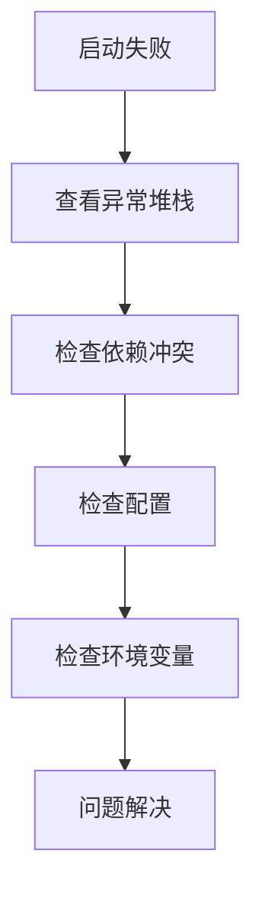
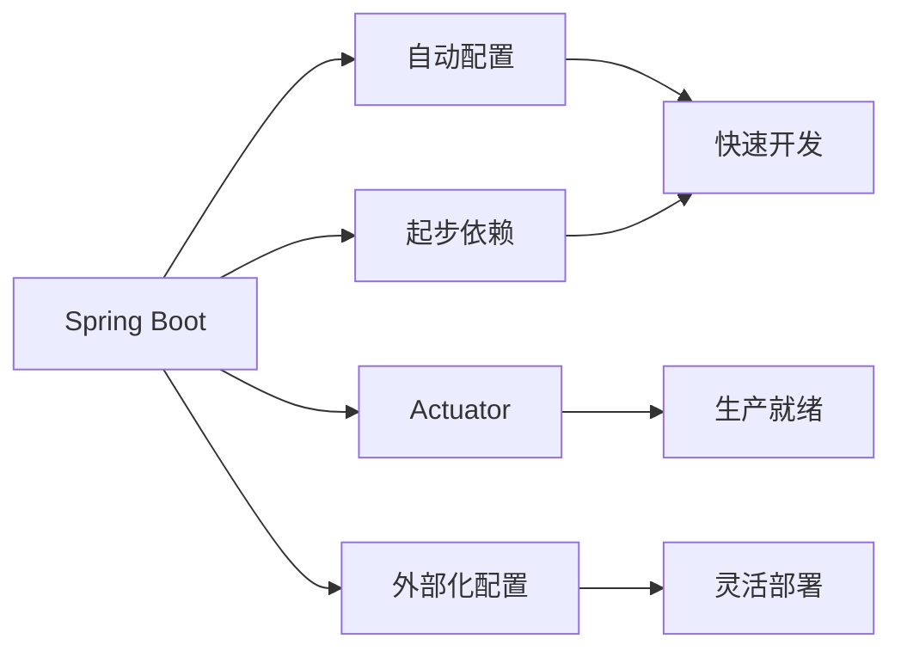

## 8. Spring Boot Actuator 监控端点

Spring Boot Actuator 提供了生产级特性，帮助监控和管理应用。

### 8.1. 核心端点

| 端点 | 作用 | 默认启用 |
|------|------|---------|
| /health | 应用健康状态 | 是 |
| /info | 应用基本信息 | 是 |
| /metrics | 应用指标 | 是 |
| /env | 环境变量 | 否 |
| /beans | 所有Bean | 否 |
| /mappings | URL映射 | 否 |
| /shutdown | 关闭应用 | 否 |

### 8.2. 配置示例

```yaml
management:
  endpoints:
    web:
      exposure:
        include: health,info,metrics
  endpoint:
    health:
      show-details: always
    metrics:
      enabled: true
```

### 8.3. 自定义端点

```java
@Component
@Endpoint(id = "custom")
public class CustomEndpoint {
    
    @ReadOperation
    public Map<String, String> customInfo() {
        return Map.of("status", "OK", "timestamp", Instant.now().toString());
    }
}
```

## 9. 外部化配置原理

Spring Boot 支持多种外部配置方式，优先级从高到低：

1. 命令行参数
2. JNDI属性
3. Java系统属性
4. 操作系统环境变量
5. 随机属性
6. 应用外部的application-{profile}.yml/properties
7. 应用内部的application-{profile}.yml/properties
8. @PropertySource注解
9. 默认属性

### 9.1. 配置加载源码

```java
// ConfigFileApplicationListener.java
protected void load(ConfigurableEnvironment environment, ResourceLoader resourceLoader, String name) {
    // 加载application.yml/properties
    for (PropertySource<?> propertySource : load(environment, resourceLoader, name)) {
        environment.getPropertySources().addLast(propertySource);
    }
}

// PropertySourcesLoader.java
public PropertySource<?> load() throws IOException {
    if (this.resource.exists()) {
        if (this.name.endsWith(".yml") || this.name.endsWith(".yaml")) {
            // 加载YAML配置
            return new YamlPropertySourceLoader().load(this.resource.getFilename(), this.resource);
        }
        return new PropertiesPropertySourceLoader().load(this.resource.getFilename(), this.resource);
    }
    return null;
}
```

## 10. 自动配置原理深入

### 10.1. 条件注解

| 注解 | 作用 |
|------|------|
| @ConditionalOnClass | 类路径存在指定类时生效 |
| @ConditionalOnMissingBean | 容器中不存在指定Bean时生效 |
| @ConditionalOnProperty | 配置属性满足条件时生效 |
| @ConditionalOnWebApplication | Web应用时生效 |
| @ConditionalOnExpression | SpEL表达式为true时生效 |

### 10.2. 自动配置示例

```java
@Configuration
@ConditionalOnClass({DataSource.class, EmbeddedDatabaseType.class})
@EnableConfigurationProperties(DataSourceProperties.class)
@Import({DataSourcePoolMetadataProvidersConfiguration.class, 
         DataSourceInitializationConfiguration.class})
public class DataSourceAutoConfiguration {
    
    @Configuration
    @Conditional(EmbeddedDatabaseCondition.class)
    @ConditionalOnMissingBean({DataSource.class, XADataSource.class})
    @Import(EmbeddedDataSourceConfiguration.class)
    protected static class EmbeddedDatabaseConfiguration {
    }
    
    @Configuration
    @Conditional(PooledDataSourceCondition.class)
    @ConditionalOnMissingBean({DataSource.class, XADataSource.class})
    @Import({DataSourceConfiguration.Hikari.class, 
            DataSourceConfiguration.Tomcat.class,
            DataSourceConfiguration.Dbcp2.class,
            DataSourceConfiguration.Generic.class})
    protected static class PooledDataSourceConfiguration {
    }
}
```

## 11. 性能调优建议

### 11.1. 启动优化

1. **减少自动配置**：
   ```java
   @SpringBootApplication(exclude = {
       DataSourceAutoConfiguration.class,
       HibernateJpaAutoConfiguration.class
   })
   ```

2. **懒加载**：
   ```yaml
   spring:
     main:
       lazy-initialization: true
   ```

3. **组件扫描优化**：
   ```java
   @ComponentScan(basePackages = "com.myapp")
   ```

### 11.2. 运行时优化

1. **JVM参数**：
   ```
   -Xms512m -Xmx512m -XX:MaxMetaspaceSize=256m
   ```

2. **Tomcat优化**：
   ```yaml
   server:
     tomcat:
       max-threads: 200
       min-spare-threads: 10
   ```

3. **缓存配置**：
   ```java
   @Configuration
   @EnableCaching
   public class CacheConfig {
       @Bean
       public CacheManager cacheManager() {
           return new ConcurrentMapCacheManager("users");
       }
   }
   ```

## 12. 常见问题排查

### 12.1. Bean冲突

**现象**：`NoUniqueBeanDefinitionException`

**解决方案**：
```java
@Autowired
@Qualifier("primaryDataSource")
private DataSource dataSource;
```

### 12.2. 配置不生效

**排查步骤**：
1. 检查`application.properties/yml`位置
2. 检查profile是否激活
3. 查看环境变量`debug=true`输出自动配置报告

### 12.3. 启动失败

**排查步骤**：
1. 查看日志中的异常堆栈
2. 检查依赖冲突
3. 使用`--debug`参数启动查看详细日志



## 13. 最新特性

### 13.1. Spring Boot 3.0新特性

1. **Java 17基线**
2. **GraalVM原生镜像支持**
3. **Jakarta EE 9+**
4. **改进的Micrometer指标**
5. **增强的AOT处理**

### 13.2. 示例：原生镜像构建

```bash
# 安装GraalVM
sdk install java 22.3.r17-nik
sdk use java 22.3.r17-nik

# 构建原生镜像
mvn -Pnative native:compile
```

## 14. 总结

Spring Boot通过自动配置、起步依赖等特性极大简化了Spring应用的开发。深入理解其核心原理可以帮助开发者：

1. 更高效地使用框架特性
2. 快速定位和解决问题
3. 进行针对性性能优化
4. 扩展框架功能

建议开发者：
- 定期查看官方文档更新
- 关注Spring生态发展
- 参与社区贡献
- 实践最佳实践


