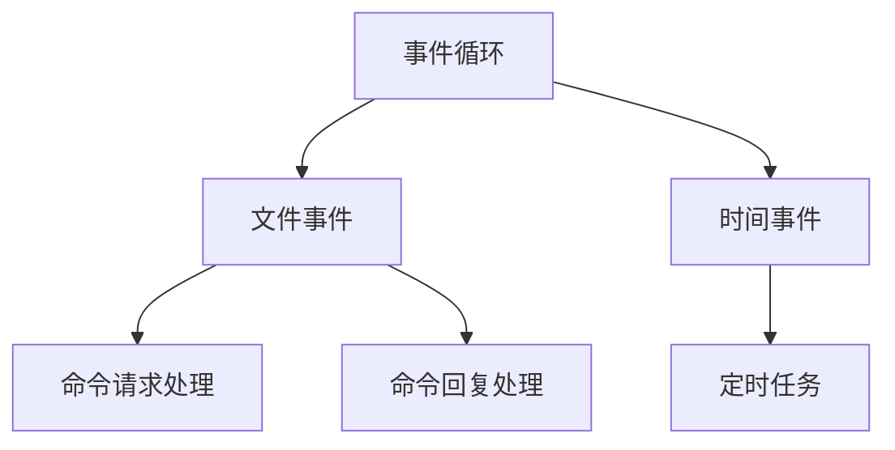
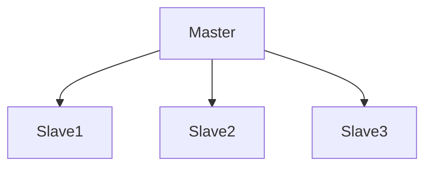
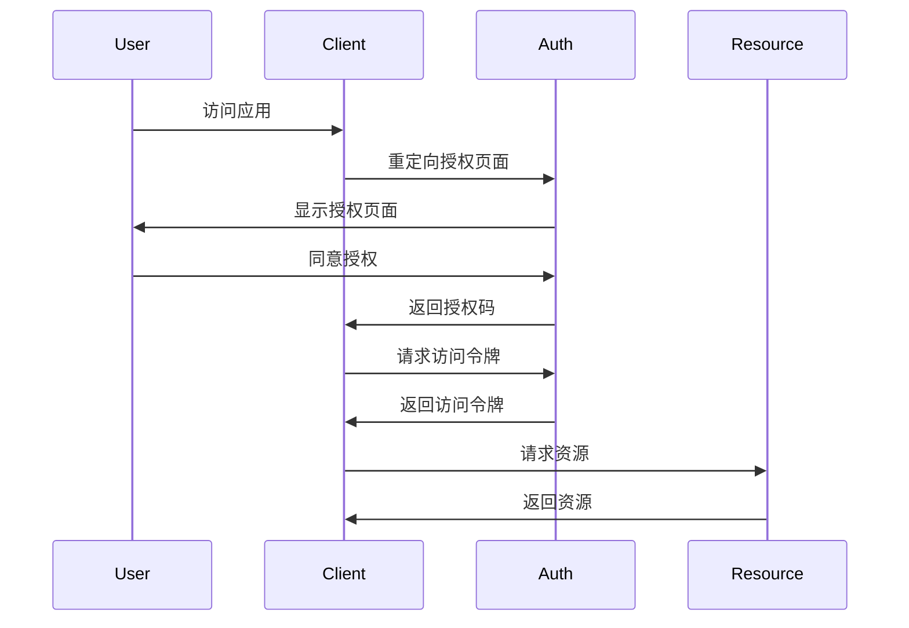
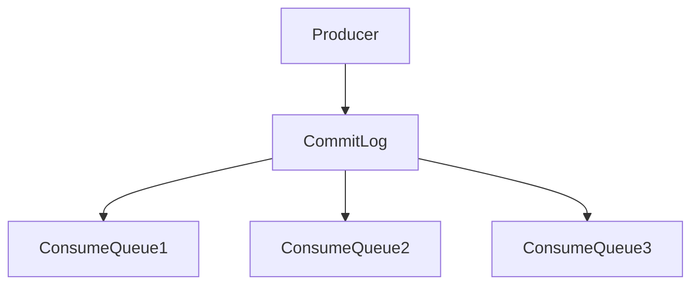
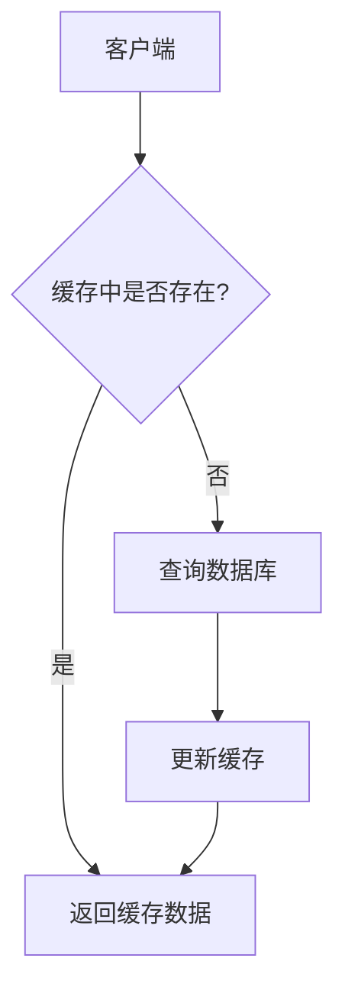
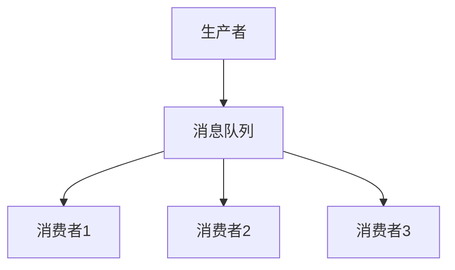
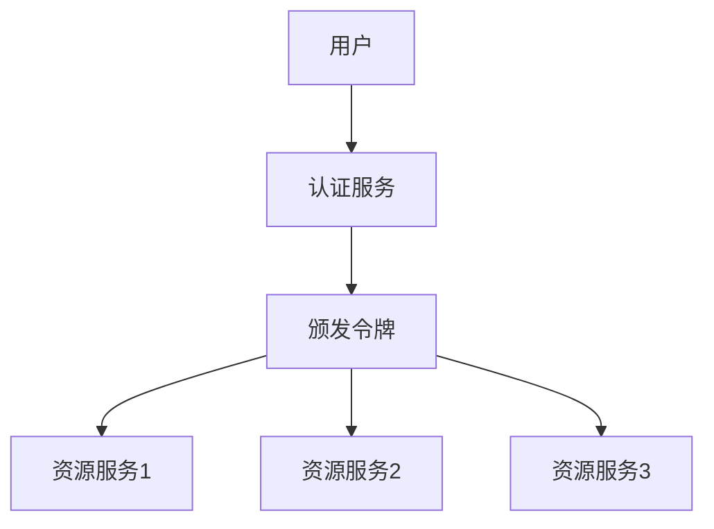

# 中间件技术详解

## 1. Redis

### 1.1 基础架构

#### 1.1.1 线程模型

Redis采用单线程模型（6.0版本后网络模型改为多线程）：
- 文件事件处理器（File Event Handler）
- 时间事件处理器（Time Event Handler）
- 事件循环（Event Loop）



#### 1.1.2 基本数据结构

1. **String**：字符串
    - 最大512MB
    - 二进制安全
    - 实现：SDS（Simple Dynamic String）

2. **List**：列表
    - 双向链表实现
    - 最大长度2^32-1
    - 实现：quicklist（ziplist + linkedlist）

3. **Hash**：哈希表
    - 字典实现
    - 渐进式rehash
    - 实现：ziplist或hashtable

4. **Set**：集合
    - 无序唯一
    - 实现：intset或hashtable

5. **Sorted Set**：有序集合
    - skiplist实现
    - 实现：ziplist或skiplist+dict

### 1.2 缓存机制

#### 1.2.1 缓存过期策略

1. **定期删除**
```java
// 伪代码示例
public void activeExpireCycle() {
    // 每次处理的数据库数量
    int dbs = server.dbnum;
    
    for (int j = 0; j < dbs; j++) {
        // 随机检查一部分key
        int expired = 0;
        for (int i = 0; i < KEYS_PER_LOOP; i++) {
            if (checkIfKeyExpired(randomKey())) {
                deleteKey(randomKey());
                expired++;
            }
        }
    }
}
```

2. **惰性删除**
```java
public Value get(Key key) {
    if (isExpired(key)) {
        delete(key);
        return null;
    }
    return getValue(key);
}
```

#### 1.2.2 内存淘汰策略

1. **noeviction**：不淘汰，写入报错
2. **allkeys-lru**：最近最少使用
3. **volatile-lru**：过期key中最少使用
4. **allkeys-random**：随机淘汰
5. **volatile-random**：过期key中随机
6. **volatile-ttl**：过期时间最近

```yaml
# redis.conf
maxmemory 2gb
maxmemory-policy allkeys-lru
```

#### 1.2.3 缓存问题处理

1. **缓存穿透**
```java
public String getWithBloomFilter(String key) {
    // 布隆过滤器检查
    if (!bloomFilter.mightContain(key)) {
        return null;
    }
    
    // 查询缓存
    String value = redis.get(key);
    if (value != null) {
        return value;
    }
    
    // 查询数据库
    value = db.get(key);
    if (value != null) {
        redis.set(key, value);
        bloomFilter.put(key);
    }
    
    return value;
}
```

2. **缓存击穿**
```java
public String getWithMutex(String key) {
    String value = redis.get(key);
    if (value != null) {
        return value;
    }
    
    // 获取互斥锁
    String lockKey = "lock:" + key;
    if (redis.setNx(lockKey, "1", 10, TimeUnit.SECONDS)) {
        try {
            // 双重检查
            value = redis.get(key);
            if (value != null) {
                return value;
            }
            
            // 查询数据库
            value = db.get(key);
            redis.set(key, value);
            return value;
        } finally {
            redis.del(lockKey);
        }
    } else {
        // 等待一段时间后重试
        Thread.sleep(50);
        return getWithMutex(key);
    }
}
```

3. **缓存雪崩**
```java
public void setWithRandomExpire(String key, String value) {
    // 过期时间加随机值，避免同时过期
    long randomExpire = baseExpireTime + random.nextInt(RANDOM_RANGE);
    redis.setEx(key, value, randomExpire);
}
```

### 1.3 持久化机制

#### 1.3.1 RDB（快照持久化）

```bash
# redis.conf
save 900 1      # 900秒内有1个修改
save 300 10     # 300秒内有10个修改
save 60 10000   # 60秒内有10000个修改
```

#### 1.3.2 AOF（日志持久化）

```bash
# redis.conf
appendonly yes
appendfsync everysec  # always/everysec/no
```

### 1.4 高可用方案

#### 1.4.1 主从复制



```bash
# slave配置
replicaof 192.168.1.1 6379
```

#### 1.4.2 分布式锁实现

```java
public class RedisDistributedLock {
    private StringRedisTemplate redisTemplate;
    private String lockKey;
    private String lockValue;
    private long expireTime;
    
    public boolean tryLock() {
        // 使用SET NX EX命令
        return redisTemplate.opsForValue()
            .setIfAbsent(lockKey, lockValue, expireTime, TimeUnit.MILLISECONDS);
    }
    
    public boolean unlock() {
        // 使用Lua脚本确保原子性
        String script = "if redis.call('get', KEYS[1]) == ARGV[1] then " +
                       "return redis.call('del', KEYS[1]) else return 0 end";
        return redisTemplate.execute(new DefaultRedisScript<>(script, Boolean.class),
            Collections.singletonList(lockKey), lockValue);
    }
}
```

#### 1.4.3 扩缩容方案

1. **水平扩展**：Redis Cluster
```bash
# 创建集群
redis-cli --cluster create 127.0.0.1:7000 127.0.0.1:7001 127.0.0.1:7002 \
    127.0.0.1:7003 127.0.0.1:7004 127.0.0.1:7005 \
    --cluster-replicas 1
```

2. **Proxy中间件**：Twemproxy
```yaml
alpha:
  listen: 127.0.0.1:22121
  hash: fnv1a_64
  distribution: ketama
  auto_eject_hosts: true
  redis: true
  servers:
   - 127.0.0.1:6379:1
   - 127.0.0.1:6380:1
```

## 2. OAuth 2.0

### 2.1 认证流程

#### 2.1.1 授权码模式



#### 2.1.2 Filter实现

```java
@Component
public class OAuth2AuthenticationFilter extends OncePerRequestFilter {
    
    @Autowired
    private TokenService tokenService;
    
    @Override
    protected void doFilterInternal(HttpServletRequest request,
                                  HttpServletResponse response,
                                  FilterChain chain) throws ServletException, IOException {
        // 获取token
        String token = extractToken(request);
        if (token == null) {
            response.sendError(HttpServletResponse.SC_UNAUTHORIZED);
            return;
        }
        
        // 验证token
        if (!tokenService.validateToken(token)) {
            response.sendError(HttpServletResponse.SC_UNAUTHORIZED);
            return;
        }
        
        // 设置认证信息
        SecurityContextHolder.getContext()
            .setAuthentication(createAuthentication(token));
        
        chain.doFilter(request, response);
    }
    
    private String extractToken(HttpServletRequest request) {
        String header = request.getHeader("Authorization");
        if (header != null && header.startsWith("Bearer ")) {
            return header.substring(7);
        }
        return null;
    }
}
```

### 2.2 Token管理

#### 2.2.1 Token申请

```java
@Service
public class TokenService {
    
    @Autowired
    private RedisTemplate<String, OAuth2Token> redisTemplate;
    
    public OAuth2Token createToken(Authentication authentication) {
        OAuth2Token token = new OAuth2Token();
        token.setAccessToken(generateToken());
        token.setRefreshToken(generateToken());
        token.setExpiresIn(3600);
        
        // 存储token
        String key = "token:" + token.getAccessToken();
        redisTemplate.opsForValue().set(key, token, 1, TimeUnit.HOURS);
        
        return token;
    }
    
    private String generateToken() {
        return UUID.randomUUID().toString();
    }
}
```

#### 2.2.2 Token续约

```java
public OAuth2Token refreshToken(String refreshToken) {
    // 验证刷新令牌
    OAuth2Token oldToken = findByRefreshToken(refreshToken);
    if (oldToken == null || isRefreshTokenExpired(oldToken)) {
        throw new InvalidTokenException();
    }
    
    // 创建新token
    OAuth2Token newToken = createToken(oldToken.getAuthentication());
    
    // 删除旧token
    deleteToken(oldToken);
    
    return newToken;
}
```

#### 2.2.3 Token过期处理

```java
@Scheduled(fixedRate = 3600000) // 每小时执行一次
public void cleanExpiredTokens() {
    Set<String> keys = redisTemplate.keys("token:*");
    for (String key : keys) {
        OAuth2Token token = redisTemplate.opsForValue().get(key);
        if (token != null && isTokenExpired(token)) {
            redisTemplate.delete(key);
        }
    }
}
```

## 3. RocketMQ

### 3.1 基础概念

- **Topic**：消息主题
- **Tag**：消息标签
- **Producer**：消息生产者
- **Consumer**：消息消费者
- **Broker**：消息服务器
- **NameServer**：注册中心
- **Queue**：消息队列
- **Group**：生产者/消费者组

### 3.2 消息发送

#### 3.2.1 同步发送

```java
public class SyncProducer {
    public static void main(String[] args) throws Exception {
        DefaultMQProducer producer = new DefaultMQProducer("ProducerGroup");
        producer.setNamesrvAddr("localhost:9876");
        producer.start();
        
        Message msg = new Message("TopicTest",
            "TagA",
            "Hello RocketMQ".getBytes(RemotingHelper.DEFAULT_CHARSET)
        );
        
        SendResult sendResult = producer.send(msg);
        System.out.printf("%s%n", sendResult);
        
        producer.shutdown();
    }
}
```

#### 3.2.2 异步发送

```java
public class AsyncProducer {
    public static void main(String[] args) throws Exception {
        DefaultMQProducer producer = new DefaultMQProducer("ProducerGroup");
        producer.setNamesrvAddr("localhost:9876");
        producer.start();
        producer.setRetryTimesWhenSendAsyncFailed(0);
        
        Message msg = new Message("TopicTest",
            "TagA",
            "Hello RocketMQ".getBytes(RemotingHelper.DEFAULT_CHARSET)
        );
        
        producer.send(msg, new SendCallback() {
            @Override
            public void onSuccess(SendResult sendResult) {
                System.out.printf("%-10d OK %s %n", index, sendResult.getMsgId());
            }
            
            @Override
            public void onException(Throwable e) {
                System.out.printf("%-10d Exception %s %n", index, e);
                e.printStackTrace();
            }
        });
    }
}
```

### 3.3 消息消费

#### 3.3.1 Push模式

```java
public class PushConsumer {
    public static void main(String[] args) throws Exception {
        DefaultMQPushConsumer consumer = new DefaultMQPushConsumer("ConsumerGroup");
        consumer.setNamesrvAddr("localhost:9876");
        consumer.subscribe("TopicTest", "*");
        
        consumer.registerMessageListener(new MessageListenerConcurrently() {
            @Override
            public ConsumeConcurrentlyStatus consumeMessage(List<MessageExt> msgs,
                                                          ConsumeConcurrentlyContext context) {
                System.out.printf("%s Receive New Messages: %s %n", 
                    Thread.currentThread().getName(), msgs);
                return ConsumeConcurrentlyStatus.CONSUME_SUCCESS;
            }
        });
        
        consumer.start();
    }
}
```

#### 3.3.2 Pull模式

```java
public class PullConsumer {
    private static final Map<MessageQueue, Long> OFFSET_TABLE = new HashMap<>();
    
    public static void main(String[] args) throws Exception {
        DefaultMQPullConsumer consumer = new DefaultMQPullConsumer("ConsumerGroup");
        consumer.setNamesrvAddr("localhost:9876");
        consumer.start();
        
        Set<MessageQueue> mqs = consumer.fetchSubscribeMessageQueues("TopicTest");
        for (MessageQueue mq : mqs) {
            SINGLE_MQ:
            while (true) {
                PullResult pullResult = consumer.pullBlockIfNotFound(mq, null, 
                    getMessageQueueOffset(mq), 32);
                putMessageQueueOffset(mq, pullResult.getNextBeginOffset());
                
                switch (pullResult.getPullStatus()) {
                    case FOUND:
                        // 处理消息
                        processMessage(pullResult.getMsgFoundList());
                        break;
                    case NO_MATCHED_MSG:
                        break;
                    case NO_NEW_MSG:
                        break SINGLE_MQ;
                    case OFFSET_ILLEGAL:
                        break;
                    default:
                        break;
                }
            }
        }
        consumer.shutdown();
    }
    
    private static long getMessageQueueOffset(MessageQueue mq) {
        Long offset = OFFSET_TABLE.get(mq);
        return offset != null ? offset : 0;
    }
    
    private static void putMessageQueueOffset(MessageQueue mq, long offset) {
        OFFSET_TABLE.put(mq, offset);
    }
    
    private static void processMessage(List<MessageExt> msgs) {
        for (MessageExt msg : msgs) {
            System.out.println(new String(msg.getBody()));
        }
    }
}
```

### 3.4 消息持久化

RocketMQ采用CommitLog和ConsumeQueue两级存储结构：



- **CommitLog**：所有消息的物理存储文件
- **ConsumeQueue**：逻辑队列，记录消息在CommitLog中的位置

```bash
# 存储路径配置
storePathRootDir=/home/rocketmq/store
storePathCommitLog=/home/rocketmq/store/commitlog
```

### 3.5 消息隔离

1. **Topic隔离**：不同业务使用不同Topic
2. **Tag过滤**：同一Topic下使用Tag区分消息类型
3. **Group隔离**：不同消费者组独立消费

```java
// 订阅特定Tag的消息
consumer.subscribe("TopicTest", "TagA || TagB");
```

### 3.6 ACK机制

```java
consumer.registerMessageListener(new MessageListenerConcurrently() {
    @Override
    public ConsumeConcurrentlyStatus consumeMessage(List<MessageExt> msgs,
                                                   ConsumeConcurrentlyContext context) {
        try {
            // 处理消息
            processMessage(msgs);
            return ConsumeConcurrentlyStatus.CONSUME_SUCCESS; // 成功ACK
        } catch (Exception e) {
            return ConsumeConcurrentlyStatus.RECONSUME_LATER; // 失败重试
        }
    }
});
```

### 3.7 消费失败重试机制

```yaml
# broker配置
maxReconsumeTimes: 16  # 最大重试次数
retryQueueNums: 1      # 重试队列数量
```

```java
// 消息重试间隔
public class RetryMessageDelayLevel {
    private static final String DELAY = "1s 5s 10s 30s 1m 2m 3m 4m 5m 6m 7m 8m 9m 10m 20m 30m 1h 2h";
}
```

## 4. 国密加密算法SM4

### 4.1 算法简介

SM4是中国国家密码管理局发布的商用密码算法标准：
- 分组长度：128位
- 密钥长度：128位
- 加密轮数：32轮
- 算法结构：非平衡Feistel网络

### 4.2 核心实现

#### 4.2.1 加密/解密工具类

```java
public class SM4Utils {
    private static final int BLOCK_SIZE = 16;
    
    public static byte[] encrypt(byte[] input, byte[] key) throws Exception {
        Cipher cipher = Cipher.getInstance("SM4/ECB/PKCS5Padding");
        SecretKeySpec secretKey = new SecretKeySpec(key, "SM4");
        cipher.init(Cipher.ENCRYPT_MODE, secretKey);
        return cipher.doFinal(input);
    }
    
    public static byte[] decrypt(byte[] input, byte[] key) throws Exception {
        Cipher cipher = Cipher.getInstance("SM4/ECB/PKCS5Padding");
        SecretKeySpec secretKey = new SecretKeySpec(key, "SM4");
        cipher.init(Cipher.DECRYPT_MODE, secretKey);
        return cipher.doFinal(input);
    }
}
```

#### 4.2.2 服务层封装

```java
@Service
public class SecureTransferService {
    private final byte[] key;
    
    public SecureTransferService(@Value("${sm4.key}") String keyBase64) {
        this.key = Base64.getDecoder().decode(keyBase64);
    }
    
    public String encryptData(String data) {
        try {
            byte[] encrypted = SM4Utils.encrypt(
                data.getBytes(StandardCharsets.UTF_8), key);
            return Base64.getEncoder().encodeToString(encrypted);
        } catch (Exception e) {
            throw new RuntimeException("加密失败", e);
        }
    }
    
    public String decryptData(String encryptedBase64) {
        try {
            byte[] encrypted = Base64.getDecoder().decode(encryptedBase64);
            byte[] decrypted = SM4Utils.decrypt(encrypted, key);
            return new String(decrypted, StandardCharsets.UTF_8);
        } catch (Exception e) {
            throw new RuntimeException("解密失败", e);
        }
    }
}
```

### 4.3 应用场景

#### 4.3.1 敏感数据存储

```java
@Entity
public class UserInfo {
    @Id
    private Long id;
    
    private String username;
    
    @Convert(converter = EncryptedStringConverter.class)
    private String idCard;  // 加密存储
    
    @Convert(converter = EncryptedStringConverter.class)
    private String phoneNumber;  // 加密存储
    
    // getters and setters
}

@Converter
public class EncryptedStringConverter implements AttributeConverter<String, String> {
    
    @Autowired
    private SecureTransferService secureService;
    
    @Override
    public String convertToDatabaseColumn(String attribute) {
        return attribute != null ? secureService.encryptData(attribute) : null;
    }
    
    @Override
    public String convertToEntityAttribute(String dbData) {
        return dbData != null ? secureService.decryptData(dbData) : null;
    }
}
```

#### 4.3.2 API接口加密

```java
@RestController
@RequestMapping("/api")
public class SecureApiController {
    
    @Autowired
    private SecureTransferService secureService;
    
    @PostMapping("/secure")
    public ResponseEntity<String> secureEndpoint(@RequestBody String encryptedData) {
        // 解密请求数据
        String decryptedRequest = secureService.decryptData(encryptedData);
        
        // 处理业务逻辑
        String responseData = processBusinessLogic(decryptedRequest);
        
        // 加密响应数据
        String encryptedResponse = secureService.encryptData(responseData);
        
        return ResponseEntity.ok(encryptedResponse);
    }
    
    private String processBusinessLogic(String requestData) {
        // 业务处理
        return "处理结果: " + requestData;
    }
}
```

### 4.4 SM4与AES对比

| 特性 | SM4 | AES |
|------|-----|-----|
| 来源 | 中国国家密码管理局 | 美国国家标准与技术研究院 |
| 分组长度 | 128位 | 128位 |
| 密钥长度 | 128位 | 128/192/256位 |
| 加密轮数 | 32轮 | 10/12/14轮 |
| 算法结构 | 非平衡Feistel网络 | 替换-置换网络 |
| 硬件加速 | 国产CPU支持 | Intel/AMD CPU支持 |
| 应用场景 | 国内金融、政务系统 | 全球广泛应用 |

## 5. 总结与最佳实践

### 5.1 中间件选型建议

| 需求 | 推荐中间件 | 理由 |
|------|-----------|------|
| 高性能缓存 | Redis | 内存存储、丰富数据结构、高可用方案 |
| 分布式锁 | Redis + Redlock | 轻量级、高性能、可靠性高 |
| 认证授权 | OAuth 2.0 + JWT | 标准协议、无状态令牌、易于集成 |
| 消息队列(低延迟) | RocketMQ | 高吞吐、可靠性好、顺序消息支持 |
| 消息队列(生态) | Kafka | 超高吞吐、流处理、生态丰富 |
| 数据加密 | SM4(国内)/AES(国际) | 安全性高、性能好、标准算法 |

### 5.2 架构设计模式

#### 5.2.1 缓存架构模式



**最佳实践**：
1. 缓存预热
2. 缓存更新策略（Cache-Aside、Read-Through、Write-Through、Write-Behind）
3. 多级缓存（本地缓存 + 分布式缓存）
4. 缓存穿透、击穿、雪崩防护

#### 5.2.2 消息队列架构模式



**最佳实践**：
1. 消息幂等处理
2. 消息持久化
3. 消息重试策略
4. 死信队列处理
5. 消息轨迹追踪

#### 5.2.3 认证授权架构模式



**最佳实践**：
1. 令牌无状态化（JWT）
2. 细粒度权限控制
3. 令牌刷新机制
4. 多因素认证
5. 安全通信（HTTPS）

### 5.3 性能优化建议

#### 5.3.1 Redis性能优化

1. **合理使用数据结构**：根据场景选择合适的数据结构
2. **批量操作**：使用pipeline、mget、mset等批量命令
3. **合理设置过期时间**：避免同时过期导致的缓存雪崩
4. **内存优化**：启用压缩、合理设置maxmemory和淘汰策略
5. **连接池管理**：使用连接池复用连接

#### 5.3.2 RocketMQ性能优化

1. **合理设置Topic和队列数**：根据并发需求设置队列数
2. **批量发送和消费**：减少网络开销
3. **异步发送**：提高发送吞吐量
4. **合理设置消费者并发度**：根据业务特点设置消费线程数
5. **消息压缩**：减少网络传输量

#### 5.3.3 OAuth2性能优化

1. **使用JWT减少状态查询**：无需每次验证都查询令牌存储
2. **令牌缓存**：缓存常用令牌信息
3. **适当的令牌有效期**：平衡安全性和用户体验
4. **分布式令牌存储**：使用Redis等高性能存储
5. **减少认证服务负载**：使用公钥验证JWT签名

## 6. 参考资源

### 6.1 官方文档

- [Redis官方文档](https://redis.io/documentation)
- [OAuth 2.0规范](https://oauth.net/2/)
- [RocketMQ官方文档](https://rocketmq.apache.org/docs/quick-start/)
- [国家密码管理局](http://www.oscca.gov.cn/)

### 6.2 开源项目

- [Redisson](https://github.com/redisson/redisson)：Redis Java客户端
- [Spring Security OAuth](https://github.com/spring-projects/spring-security-oauth)
- [RocketMQ-Spring](https://github.com/apache/rocketmq-spring)
- [Bouncycastle](https://www.bouncycastle.org/)：密码学库

### 6.3 书籍推荐

- 《Redis设计与实现》
- 《OAuth 2.0实战》
- 《RocketMQ技术内幕》
- 《密码学原理与实践》

---

本文详细介绍了Redis、OAuth2、RocketMQ和国密SM4算法等中间件技术的核心原理和实践应用。通过深入理解这些技术，开发者可以构建更高效、可靠的分布式系统。
